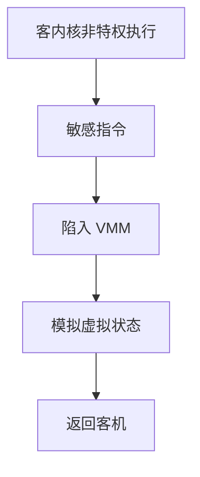

# 陷阱与模拟

可虚拟化的 ISA 让敏感指令在非特权运行时陷入；VMM 模拟其效果，于是客内核以为自己仍在全特权。

<footer>—— 据 Popek and Goldberg, Formal Requirements for Virtualizable Third Generation Architectures, CACM 1974 整理</footer>

[上一课](/cs/seccomp-filter)过滤的是系统调用，对象是本机用户进程。[特权级](/cs/privilege-rings) 已有环。[容器](/cs/container-os) 没有第二套内核。缺口是 **VMM**：在宿主内核（或 type-1 监控器）上跑一个以为自己管理机器的客内核。Popek/Goldberg：敏感指令必须是特权指令，否则无法陷入。

## 问题

客内核执行「改页表根、关中断、写设备」——若真执行，会毁掉宿主。若 ISA 满足条件：把客内核放在非特权环，这些指令陷入，VMM 改影子状态再返回。缺口：控制敏感（影响配置）与行为敏感（结果依赖特权模式）都必须陷入。x86 历史上一批指令不满足，于是有二进制翻译或硬件辅助（下一课 EPT）。本课不写如何从客机攻击宿主。

陷入不是 seccomp：对象是指令，不是 syscall 号。用户程序在客机里的 syscall 由客内核处理；客内核的特权指令才到 VMM。

## 方法

VMM 维护客机的虚拟 CPU 状态。陷入：译码敏感指令，更新虚拟中断标志、虚拟 MMU 等，恢复客机 PC 的下一条。I/O 指令同样模拟或交给下一课 virtio。与 [缺页路径](/cs/page-fault-path) 对照：那是进程对宿主页表；这里是客机对「虚拟物理内存」的访问，可能再由 VMM 映射到真机。

## 机制

trap-and-emulate 让「一台机器多套内核」在软件上可陈述：每套内核操作的是虚拟资源。性能取决于陷入频率。不能虚拟化的指令必须改写客代码或靠硬件扩展。本课引用 Popek/Goldberg 的充分条件，不把现代 x86 手册逐条对照考完。

与用户/内核分裂：宿主仍用自己的分裂；客机有自己的一套，由 VMM 嵌套解释，直到下一课硬件嵌套页表。

## 边界

本课不引入二进制翻译的全部动态编译。不保证所有 RISC-V 虚拟化扩展细节。下一课：客机 GPA→HPA 的第二层页表，减少影子页表的软件负担。

后课默认：敏感指令可陷入模拟。客机物理地址如何硬件翻译，下一课 EPT/NPT。

## 小结

- 可虚拟化 ISA：敏感指令必陷入，VMM 模拟。
- 容器过滤 syscall；VMM 拦截特权指令。
- 嵌套页表是 EPT/NPT 的缺口。
- 出处：Popek and Goldberg, *CACM* 1974；Tanenbaum *MOS*。
