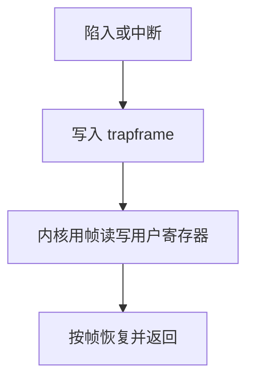

# trapframe

陷入必须把用户可见的寄存器收进内核栈上的一帧，返回时原样写回；否则用户程序会在随机寄存器里醒来。

<footer>—— 据 Tanenbaum and Bos, Modern Operating Systems；Bovet and Cesati 整理</footer>

[上一课](/cs/vdso)让部分查询免陷入。一旦执行陷入指令或发生异常、中断，[异常入口](/cs/exception-interrupt-entry)会切特权并跳到固定向量。缺口是：硬件只保证保存 PC 与原因；**通用寄存器、用户栈指针、返回后的特权级**要由软件收成一份可恢复的帧——trapframe。本课只钉这帧，不走系统调用分发。

## 问题

用户线程的 `a0`–`a7` 里可能正是系统调用参数，也可能是被中断的普通计算。若内核随手用这些寄存器当临时量，返回用户时计算已坏。跨线程切换还要把帧与[进程映像](/cs/process-image)里的其余状态接上。缺口不是新的环，而是内核栈顶那块**与 ISA 寄存器一一对应的内存映像**。

本课不把每一种架构的 `pt_regs` 字段表背完。

trapframe 通常压在该线程的内核栈上。切换线程时换内核栈指针，等于换到另一份帧。用户栈指针是帧里的一个字段，不是内核正在用的栈。

## 方法

入口：硬件或极短汇编保存 PC、状态寄存器，再把通用寄存器写入帧；内核 C 代码只通过帧读写用户状态。返回：按帧恢复，执行 `sret`/`iret`，特权降回用户。系统调用的返回值写入帧中的返回值槽，再走同一条恢复路径。中断与自愿陷入共用帧布局，便于同一套返回代码。

[调用约定](/cs/calling-convention-stack)的用户栈帧仍在用户页上；本课的对象是内核里那份架构状态副本。

## 机制

有了帧，内核可以在处理过程中调度：当前线程的用户寄存器不在 CPU 上，而在它的 trapframe 里。[上下文切换](/cs/context-switch)换的是「哪份帧成为活的」，不另造一套寄存器含义。缺页、系统调用、设备 IRQ 都先落到同一形状的帧，再按原因分发——分发是下一课路径。

内核自己的调用用内核栈上的普通帧，不要与 trapframe 混名。本课只要求：凡从用户来，先有 trapframe。

## 边界

本课不写 FPU 惰性保存的全部 ABI，不把信号递送如何改用户 PC 提前讲完。也不讨论调试器改帧里的寄存器——那是更后的跟踪课。安全课关心「有没有漏存」；本课假定保存完整。

后课默认：进入内核时用户状态在 trapframe 里。用户按 ABI 请求服务之后，如何按号分发、拷贝参数、返回，下一课走[系统调用路径](/cs/syscall-path)。

## 小结

- trapframe 是内核栈上的用户寄存器映像；返回必须按它恢复。
- 中断与系统调用共用帧布局；切换换的是哪份帧活着。
- 分发与参数拷贝是路径课的缺口。
- 出处：Tanenbaum and Bos, *MOS*；Bovet and Cesati。
