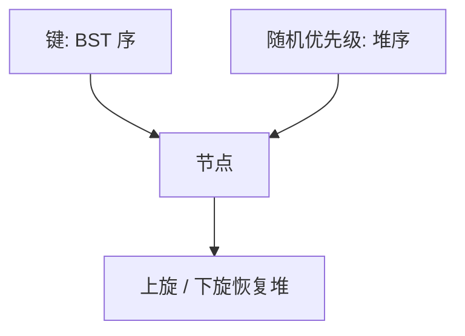

# Treap

键守 BST 序，堆序交给随机优先级；期望高度对数，旋转次数跟随机 BST 同分布。

<footer>—— 据 Seidel and Aragon, Randomized Search Trees, Algorithmica 1996；Cormen, Leiserson, Rivest and Stein 整理</footer>

[上一课](/cs/sparse-set)收束了序列区间。有序字典主干已有[BST](/cs/bst)、[AVL](/cs/avl-rotate)、[红黑直觉](/cs/rbtree-intuition)，着色与平衡因子都是确定修复。[跳表](/cs/skip-list)用随机层高。本课不重画红黑 case。缺口是 Treap：随机堆优先级 + BST 键，期望 $O(\log n)$，实现是旋转。

## 问题

确定平衡要写一长串旋转分类。随机 BST（按随机插入序）期望高度对数，但不能按任意插入序保证。Treap 给每个键独立均匀随机的优先级 $p(k)$，树同时满足：中序为键序，堆序为优先级（通常小根）。形状唯一：就是按 $p$ 排序插入 BST 的结果。缺口是**用随机优先级代替随机插入序**，从而任意更新序列下期望仍对数。

Seidel–Aragon 称之为 randomized search tree。split/merge 实现与笛卡尔树插入同构，竞赛里常用无显式旋转的分裂合并。

## 方法

插入：按 BST 挂叶，再沿堆序上旋。删除：转到叶再摘，或先把优先级改成「无穷」再下旋。split($T,k)$：按键切成 $<k$ 与 $\ge k$ 两棵 treap；merge 假定左树键全小于右树，按根优先级决定谁当根。期望 $O(\log n)$。

与跳表：都是随机期望对数、保序。Treap 是树，中序递归；跳表是多层链表。

## 机制

期望分析与随机 BST 相同：根是优先级最小的键，左右规模均匀于键秩。最坏仍可退化（优先级运气差），合同写期望，与跳表一致。不要用时间戳当优先级除非能证明随机性。

隐式 treap 用下标当键（子树 size），可当可分裂序列，本课点名：键变成位置，机制仍是 split/merge。

## 边界

本课不把并发 treap、或确定 treap（哈希优先级）的对抗分析写完。实时最坏路径用 AVL/红黑。下一课伸展树去掉随机与平衡位，改用摊还。

后课默认：随机平衡 BST 可以是 Treap。无额外随机、靠访问旋转的是 splay。

## 小结

- Treap：BST 键 + 随机堆优先级，期望对数。
- split/merge 与旋转等价。
- 摊还、无随机的自调整是下一课。
- 出处：Seidel and Aragon, *Algorithmica*, 1996；Cormen et al.。
