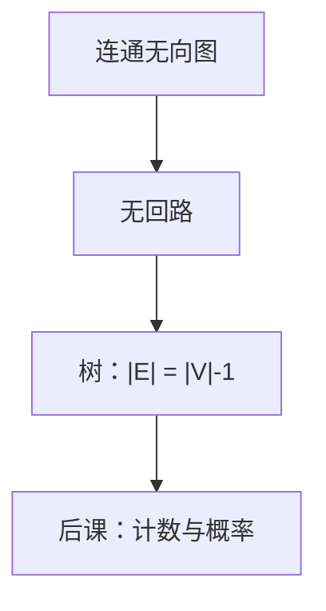

# 树作为无环连通图

连通且无回路的有限无向图，边数必是顶点数减一；任意两点恰有一条路。

<footer>—— 据 Rosen, Discrete Mathematics and Its Applications 整理</footer>

上一课[度、连通与割](/cs/degree-cut)钉死了 $G=(V,E)$ 与路、连通。本课不重讲度数和，也不从「文件系统目录」另起。缺口是：一般图可以有回路。归纳、后课递归数据结构、生成树，需要一种**没有回路还连通**的图，使「去掉叶再归纳」合法。

## 问题

连通图可以有多余的边围成圈；有圈则「父指针」会打环，结构归纳没有更小的子对象。缺口因此不是新的边类型，而是刻画树：有限无向简单图 $T$ 是树，当它连通且无回路。等价条件（任证一条，其余作定理）：$|E|=|V|-1$ 且连通；任意两点恰一条路；连通但删任一边不连通。

有根树是另加一个根、把边看成指向子节点；那是表示，不是无向树定义的一部分。本课两者都用，后课递归算法默认有根。

### 树不是「长得像树枝的图」

有根二叉树在数据结构课才加「左孩子右孩子」。本课的树可以任意度数。把二叉树当成本课定义，后课并查集、最小生成树的「树」会对不上。森林是无环图，分量都是树。

Rosen 列出树的等价定义并要求会互推。$|E|=|V|-1$ 用归纳：叶存在（除非单点），删叶后仍是树。本课不把生成树算法写出。

## 方法

先证：非平凡有限树至少两片叶（度数 1）。删叶，$|V|$、$|E|$ 同减一，归纳得 $|E|=|V|-1$。反之，连通且 $|E|=|V|-1$ 则无环，否则删圈上边仍连通，边更少，与极小连通矛盾。

## 机制

树上归纳合法：对 $|V|$ 归纳，或沿根向叶子。后课文件系统、堆、BST 都是有根有序树，代价分析用高度；本课只保证无环故高度有定义（有根时）。图若有环，DFS 会遇到回边——算法课再分边类型；本课只提供「无环」这个前提。

生成树是原图的生成子图且为树，边数仍是 $|V|-1$。存在性当且仅当原图连通。算法（Kruskal、Prim）很后，本课只承认对象。

## 边界

本课不引入有向无环图（DAG）的等价刻画——那是数据结构课末的叶子。也不把根树的平面画法、括号表示写成语法。有向树（每个点入度 1 除根）是另一套，后课再需要时再钉。

后课默认：谈到树，无向意义下连通无环；$|E|=|V|-1$。有根是额外结构。

## 小结

- 树 = 有限连通无环图；等价于恰 $|V|-1$ 条边且连通。
- 两点之间唯一路；可删叶做归纳。
- 有根、有序、二叉都是后课加上的数据。
- 出处：Rosen, *Discrete Mathematics*。
