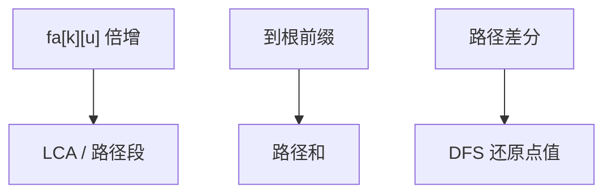

# 树上倍增与差分

$2^k$ 祖先表既答 LCA，也把路径拆成 $O(\log n)$ 段；边上或点上的增减，用差分在子树和里一次 DFS 还原。

<footer>—— 据 CLRS 第 21、22 章的倍增与前缀思想；竞赛与教材中的树上差分整理</footer>

上一课[最近公共祖先](/cs/lca)给出 `lca(u,v)` 与倍增表 `fa[k][u]`。本课不重写对齐深度再跳。缺口是**同一张表的其余用法**：路径信息（最小边权、和）沿倍增合并；以及把「路径 $+d$」变成点上差分，再 DFS 子树还原。后课重链剖分把路径变成序列上的线段树，本课先用倍增与差分做静态。

## 问题

静态有根树。路径 $u$–$v$ 拆成 $u\to lca$ 与 $v\to lca$。若只要路径边权和：预处理到根的前缀和，$ans=pre[u]+pre[v]-2\cdot pre[lca]$（边权挂在子端）。点权类似，注意 $lca$ 是否算两次。缺口是这套前缀，不是再证 LCA。

倍增聚合：`min[k][u]` 为 $u$ 上跳 $2^k$ 步路径上的边权 $\min$。查询时与跳父同步合并。适合可结合、可重复（幂等）或注意重叠的运算。不可结合的要换剖分。

树上差分：路径 $u$–$v$ 上每点 $+d$。令 $a[u]+=d$，$a[v]+=d$，$a[lca]-=d$，$a[parent[lca]]-=d$（点差分；边差分公式略改）。再从叶子向根累加子树，$a$ 变成真实点值。一次 DFS $O(n)$ 答完所有修改后的查询（离线）。

### 差分不是线段树

序列差分把区间加变成两点；树上同构，两点换成路径两端与 LCA。不要对每次询问 $O(n)$ 走路径。动态反复改结构用重链或 LCT，本课静态。

倍增与整数的二进制分解同类，快速幂课会写 $a^n$。树上差分是前缀和的树版本。无单独经典论文名时，CLRS 的前缀与并查集思想足够支撑。

## 方法

预处理深度、父、`fa[k]`、可选 `min[k]`、$O(n\log n)$。路径和用前缀。离线路径加：差分数组 + 子树和。

边权与点权选一种挂法，全程一致。

## 机制

二进制跳转覆盖任意深度差，段数 $O(\log n)$。差分正确性：除路径外，每点被加减抵消；LCA 与父的修正避免把 LCA 上方加进去。子树求和等价于从根到该点的差分前缀——与序列 $b[i]=a[i]-a[i-1]$ 同一线性关系。

不要在有向有环图上做这套前缀：唯一路径是树的性质。

## 边界

本课不写重链、不写点分治、不写动态边。子树修改（整棵子树 $+d$）是 DFS 序差分，比路径更简单，点名即可。后课默认：静态路径和/最值可用倍增或前缀；路径加用树上差分。下一课把路径切成 $O(\log n)$ 条重链，接上序列数据结构。

## 小结

- 倍增表既跳祖先也聚合路径。
- 路径和用到根前缀与 LCA；路径修改用差分 + DFS。
- 静态树；动态结构后课。
- 出处：倍增与前缀为算法课标准技法；LCA 见 Tarjan, 1979。
