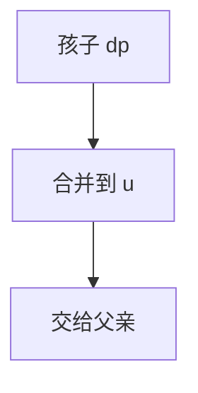

# 树形 DP

无环则子树先算完再合并到父亲；状态常是「选根或不选」「子树背包」，总 $O(n)$ 或 $O(n\cdot\text{容量})$。

<footer>—— 据 CLRS 第 15 章最优子结构；树上 DP 为标准教材技法整理</footer>

上一课[状态压缩 DP](/cs/bitmask-dp)在指数子集上。树 $n$ 可达 $10^5$，状态沿边无环。缺口是树形 DP：先 DFS 后序，把孩子 DP 合并。不重写状压。后课数位 DP 换十进制。与[点分治](/cs/centroid-decomposition)分工：一个整棵最优，一个点对统计。

## 问题

独立集：`dp[u][0/1]` 不选/选 $u$，孩子相应约束。树上背包：子树体积合并，注意循环方向防复用。换根是后课。本课固定根。

缺口是后序合并，不是生成树 MST。

### 合并顺序与背包

多个孩子做背包，$O(\sum sz)$ 要按子树大小分析，错误的 `for v in children for j backwards` 复杂度可能 $O(n^2)$。点名即可。

树独立集线性。树上背包复杂度有精细界。后课换根二次 DFS 把每个点当根。

## 方法

DFS：先孩子后自己。状态设计使边只看父子。森林逐棵。

叶子边界明确。

## 机制

树的最优子结构：最优解在子树上的限制仍最优。与 DAG DP 同，树是特殊 DAG（定根后）。与 HLD：HLD 管路径查询，树 DP 管一次全局最优。

## 边界

本课不写换根、不写虚树。有环要先 SCC 或点双。后课默认：树上选/不选、子树背包用后序 DP。下一课数位 DP。

## 小结

- 后序合并孩子；无环是前提。
- 独立集线性；背包注意复杂度。
- 固定根；换根后课。
- 出处：CLRS 第 15 章；树 DP 标准技法。
