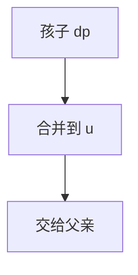

# 树形 DP

无环则子树先算完再合并到父亲；状态常是「选根或不选」「子树背包」，总 $O(n)$ 或 $O(n\cdot\text{容量})$。

<footer>—— 据 CLRS 第 15 章最优子结构；树上 DP 为标准教材技法整理</footer>

上一课[状态压缩 DP](/cs/bitmask-dp)在指数子集上。树 $n$ 可达 $10^5$，状态沿边无环。缺口是树形 DP：先 DFS 后序，把孩子 DP 合并。不重写状压。后课数位 DP 换十进制。与[点分治](/cs/centroid-decomposition)分工：一个整棵最优，一个点对统计。

## 问题

独立集：`dp[u][0/1]` 不选/选 $u$，孩子相应约束。树上背包：子树体积合并，注意循环方向防复用。换根是后课。本课固定根。

缺口是后序合并，不是生成树 MST。

### 合并顺序与背包

多个孩子做背包，$O(\sum sz)$ 要按子树大小分析，错误的 `for v in children for j backwards` 复杂度可能 $O(n^2)$。点名即可。

树独立集线性。树上背包复杂度有精细界。后课换根二次 DFS 把每个点当根。

## 方法

DFS：先孩子后自己。状态设计使边只看父子。森林逐棵。

```mermaid
flowchart TD
  CH["孩子 dp"] --> MER["合并到 u"]
  MER --> PAR["交给父亲"]
```

叶子边界明确。

## 机制

树的最优子结构：最优解在子树上的限制仍最优。与 DAG DP 同，树是特殊 DAG（定根后）。与 HLD：HLD 管路径查询，树 DP 管一次全局最优。

以最大权独立集为例，看「选 / 不选」两种状态各自怎么从孩子算出来：

```mermaid
flowchart TD
  KIDS["＂所有孩子 v 的 dp［v"][0/1]"] --> NC["u 不选: Σ max(dp[v][0], dp[v][1])"]
  KIDS --> SEL["u 选: w[u] + Σ dp[v][0]"]
  NC --> D0["dp[u][0]"]
  SEL --> D1["dp[u][1]"]
  D0 --> ANS["根处取 max 即答案"]
  D1 --> ANS
```

直觉类比：后序合并就是「先问完所有孩子，再答父亲」。孩子答完之后父亲的问题只剩一次查表加法——每个点被算一次、被看常数次，所以总时间是 $O(n)$，与树的形状无关。

常见误区：初学者容易以为树形 DP 还要像序列 DP 那样专门设计「转移顺序」。定根之后「孩子先于父亲」就是现成的拓扑序，DFS 的后序位置天然给出这个顺序，不需要再排序或建图。

## 边界

本课不写换根、不写虚树。有环要先 SCC 或点双。后课默认：树上选/不选、子树背包用后序 DP。下一课数位 DP。

术语翻译：「背包容量倒序循环」= 让本轮用到的旧值 `dp[j-w]` 还停留在「不含当前孩子」的状态。数字实例：正序走时，$w=2$ 的孩子会把 `dp[2]` 加进 `dp[4]`，又把更新过的 `dp[4]` 加进 `dp[6]`——同一个孩子被叠选；倒序走 `dp[6]` 先算，用的还是干净的旧值。

## 小结

- 后序合并孩子；无环是前提。
- 独立集线性；背包注意复杂度。
- 固定根；换根后课。
- 出处：CLRS 第 15 章；树 DP 标准技法。
