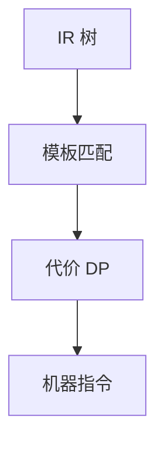

# 树匹配指令选择

IR 树用指令模板覆盖：动态规划选代价最小覆盖，每个模板对应一条或一组机器指令。

<footer>—— 据 Aho, Ganapathi and Tjiang, Code Generation Using Tree Matching and Dynamic Programming；龙书 8.9；Appel 整理</footer>

上一课[关键路径](/cs/critical-path-scheduling)假定已有机器指令。主干[指令选择](/cs/instruction-select)有直觉。缺口是 **BURS/树匹配 + DP**：像 `lea` 覆盖 `base+idx*scale`。本课钉覆盖，不写 TableGen 描述语言——下一课。调度在选择之后（或与 DAG 选择交织，如 LLVM ISel）。

## 问题

朴素：每个 IR 运算一条 RISC。CISC 与寻址模式要模式匹配。树覆盖：叶到根 DP，代价相加。缺口是**最小代价覆盖**，不是着色。

DAG 选择：公共子表达式使树变 DAG，覆盖更难（可能复制或用寄存器）。

### 覆盖不是语法分析的 Earley

虽然都是动态规划，对象是 IR 树 vs 文法。不要把 burg 当 yacc。

Aho–Ganapathi–Tjiang。TWIG、burg、iburg。LLVM SelectionDAG / GlobalISel。Appel 的 Maximal Munch 是贪心对照。

## 方法

Maximal Munch：贪心最长匹配，快，非优。DP：每个结点存各非终结符最小代价。生成：按记录的模板吐指令。

与 GVN：先编号减树大小。与立即数：选择时要认 ISA 宽度，否则后期再拆。

## 机制

非法覆盖用 expand（伪指令 → 真指令）。失败则报后端 bug。不要在选择里做全局调度。

代价：延迟、长度、是否破坏标志位。fast-math 可允许 `fma` 模板。

## 边界

本课不写 TableGen 语法。后课默认：树/DAG 覆盖做选择。下一课目标描述：把模板写成可维护的描述。

也不把指令选择当 SQL 查询选择。

## 小结

- 树匹配 + DP（或贪心 munch）覆盖 IR。
- 代价含延迟与编码约束。
- DAG 因共享比树难。
- 出处：Aho, Ganapathi and Tjiang；龙书 8.9；Appel Maximal Munch。
