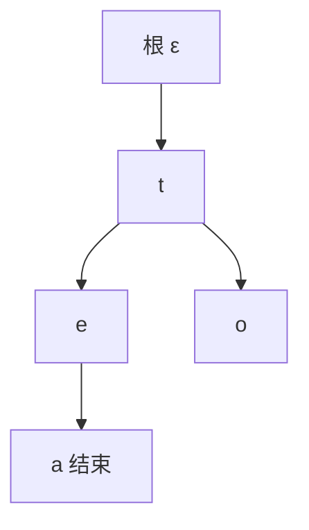

# Trie

键是串时，沿字符往下走，比较次数跟键长走，不跟表里有多少个键走；公共前缀只存一次。

<footer>—— 据 Fredkin, Trie Memory, CACM 1960；Cormen, Leiserson, Rivest and Stein 整理</footer>

[上一课](/cs/skip-list)和[散列函数](/cs/hash-function)把整键当作一次比较或一次 $h(k)$。[字符与 Unicode](/cs/skip-list)已经把串写成符号序列。本课不重讲跳表层高。缺口是：字典树按符号位（通常是字符）分支，查找代价 $\Theta(L)$，$L$ 为键长，与 $n$ 弱相关，且前缀共享省空间、支持前缀查询。

## 问题

许多键共享前缀（路径、单词）时，BST 仍从根比较整键，散列仍把整键搅成槽。缺口不是更好的 $h$，而是**边标字符、节点表示「走到这个前缀」**。结束标记表示该前缀是完整键。

扇出等于字母表大小 $|\Sigma|$。$\Sigma$ 大则数组孩子浪费，$\Sigma$ 小则数组正好吃局部性。实现可把孩子做成哈希表或有序向量——那是表示选择，ADT 是沿符号下降。

Trie 不是 tree 的拼写错误。Fredkin 从 retrieval 造词。Patricia/radix 压缩单孩子路径，本课点名不展开。

## 方法

根对应空前缀。插入键 $c_1\ldots c_L$：逐字符走或建边，末节点打结束位并可挂卫星。查找同样下降，缺边或末节点无结束位则失败。删除要考虑是否剪无兄弟的尾——可选。

与 BST 比较：BST 一次比较整键，$h\log n$；Trie 一次比较一个符号，$L$ 步。短键、大 $n$ 时 Trie 可更快；长随机键则 $L$ 本身很大。

## 机制

前缀查询：降到前缀节点，遍历子树列出全部结束标记。有序树要从 lower_bound 扫到前缀外；散列做不到。这是 Trie 作为字典的独特合同。

空间：最坏 $\Theta(\sum L_i)$ 节点。压缩路径后接近相异前缀的总量。cache：沿指针下降，类似树的追逐；孩子数组在 $|\Sigma|$ 小时更连续。

## 边界

本课不把后缀树、AC 自动机写进来。也不进入大模型词表——那是另一栏的离散符号。Unicode 字母表很大，直接 256 路只适合字节；按码点要再编码。

后课默认：串键、前缀操作可用 Trie。不相交集合的合并查找是另一合同：并查集，键是元素编号而非串。

## 小结

- Trie 按字符下降，时间跟键长，$n$ 只影响扇出实现。
- 公共前缀共享；前缀枚举自然。
- 并查集管「同属一类」，不保管键，下一课。
- 出处：Fredkin, *CACM*, 1960；Cormen et al. 对数字查找树的讨论。
