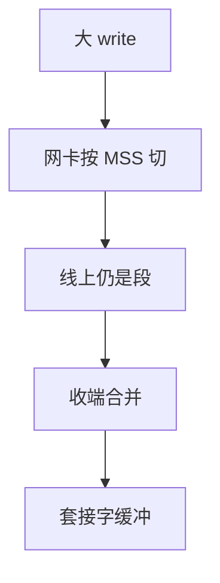
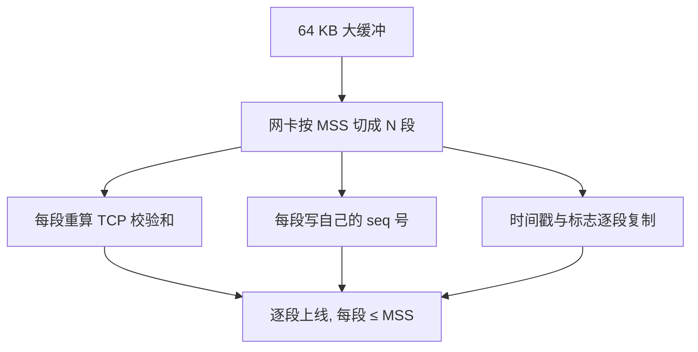

# TSO / LRO

主机把大缓冲交给网卡切 MSS 段（TSO），接收侧把连续段粘回大缓冲（LRO/GRO）；省 CPU，不改 TCP 语义，但延迟与抓包会变。

<footer>—— 据网卡卸载实践；Linux GRO 文档通识；RFC 9293 段大小对照整理</footer>

[MSS](/cs/mss-clamping) 约束线上看见的段。[上一课](/cs/diffserv-qos) 结束排队合同。缺口是**主机卸载**：TSO/GSO、LRO/GRO。本课结束 TCP 细节课序。

## 问题

每 MSS 一次系统调用与协议处理，10G 上 PPS 打满 CPU。[套接字](/cs/socket-api) 热路径要减访。TSO：栈交 64 KB，网卡按 MSS 切并算校验。GRO：收端合并再交协议。语义仍是字节流；抓包若在 GRO 后，看起来「巨段」，排障易误。延迟：合并等待可能加尾延迟，与 URLLC 目标冲突，可关。

不要把 TSO 写成巨帧：巨帧在链路上真大；TSO 在链路上仍是 MSS。

GSO 是软件切。校验卸载与 TSO 常一起开。本课不写驱动队列 API。

### 线上仍是 MSS

卸载省 CPU，不改语义。抓包在 GRO 后会看见巨段。延迟敏感路径可关合并。巨帧是另一件事。

## 方法

对照：主机切 vs 网卡切 vs 巨帧。画：应用 write → TSO → 线 MSS → GRO → read。与令牌桶：一次 TSO 突发像大 $b$。

```mermaid
flowchart TD
  APP["大 write"] --> TSO["网卡按 MSS 切"]
  TSO --> WIRE["线上仍是段"]
  WIRE --> GRO["收端合并"]
  GRO --> SOCK["套接字缓冲"]
```

## 机制

窗口、SACK、ECN 在段级；卸载必须正确复制时间戳与标志。虚拟化 virtio 也有 TSO，接 OS 课。RoCE 不走 TSO，走自己的 WQE。QUIC 常在用户态 GSO。

安全：错误卸载可造坏校验，中间盒若信卸载会放过。

一个大缓冲变成多个合法段，网卡要替栈补齐哪些逐段字段：

```mermaid
flowchart TD
  SKB["64 KB 大缓冲"] --> SEG["网卡按 MSS 切成 N 段"]
  SEG --> F1["每段重算 TCP 校验和"]
  SEG --> F2["每段写自己的 seq 号"]
  SEG --> F3["时间戳与标志逐段复制"]
  F1 --> OUT["逐段上线, 每段 ≤ MSS"]
  F2 --> OUT
  F3 --> OUT
```

数字实例：MSS = 1460 字节时，一次 64 KB 的 write（65536 字节）被切成 $\lceil 65536/1460\rceil \approx 45$ 个段。没有 TSO，栈要为每段各过一遍协议处理；开了 TSO 只走一次大缓冲路径，切与校验都下沉到网卡。

常见误区：抓包看到 60 KB 的「巨段」就以为链路在跑巨帧——其实抓包点落在 GRO 合并**之后**。线上每个以太网帧仍不超过 MSS。排障时先 `ethtool -k` 查卸载开关，必要时临时 `gro off` 对照再下结论。

## 边界

本课不引入 XDP 的全部。MPTCP 是下一课序第一课。后课默认：TSO/GRO 是 CPU 优化，线语义仍是 MSS 段。

关卸载排障是合法手段，不是永久性能方案。

直觉类比：TSO 像「一次写好 45 封信的内容，盖章装封交给邮差分件投递」——投递颗粒度（每封信的尺寸）不变，省的是你自己重复写 45 个信封、贴 45 张邮票的工夫。

下一课[MPTCP](/cs/mptcp)。

## 小结

- TSO 切发送，GRO 合并接收。
- 线上仍 MSS；巨帧是另一件事。
- 影响突发、延迟与抓包观感。
- 后课只引用本课钉死的对象，不从该领域总问题重开。
- 出处：RFC 9293 对照；网卡卸载实践。
