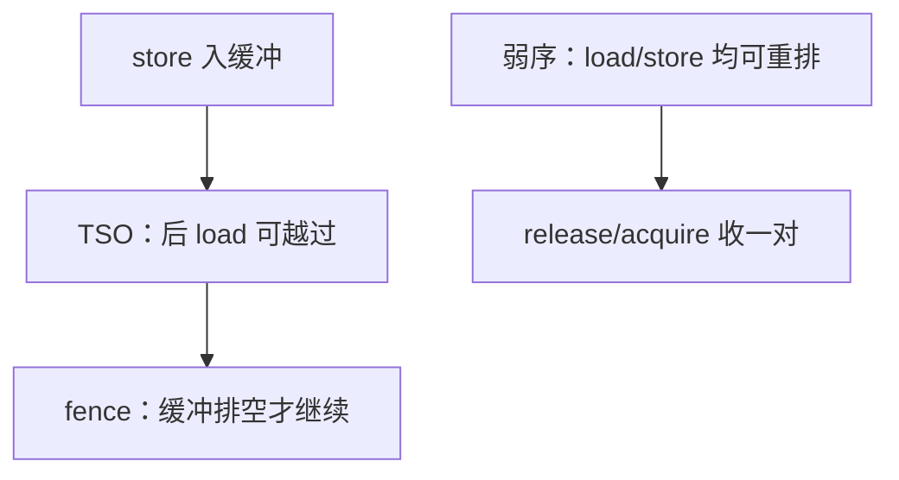

# TSO 与弱序

允许后到的 load 越过尚未耗尽的 store，store 缓冲才能对单线程藏延迟；他核可能先看见后面的写。

<footer>—— 据 SPARC Architecture Manual (TSO)；Sewell, Sarkar, Owens, Nardelli and Myreen, x86-TSO, CACM 2010；Hennessy and Patterson, CA:AQA 整理</footer>

[上一课](/cs/memory-consistency)钉了 Lamport 顺序一致性，并点名 TSO 允许 load 提前、用 fence 收回。[存储缓冲与 load 绕过](/cs/store-buffer)已经给出硬件对象。本课不重讲 MESI。缺口是把放宽写成可编程的合同：总存储序（TSO）允许什么、弱序还放掉什么，以及栅栏插在哪。

## 问题

SC 要求每核的 load/store 序出现在全局交错里。有 store 缓冲时，本核 load 已经绕过年长 store（对不同地址），他核若先看到后面那条已提交的 store、尚未看到前面那条仍在缓冲里的 store，SC 失败。TSO 承认这一条放宽：**同一核上 store 之间、load 之间保持程序序，允许 load 越过更早的 store**；所有核的 store 仍有一个总序。

弱序（许多 ARM/RISC-V 配置接近）还允许 store-store、load-load 重排，只在同步指令处恢复。缺口不是新的 cache 状态，而是程序员必须把发布/获取写成栅栏或带序的 load/store。

x86 对普通 mov 接近 TSO（另有 store 原子性等细则）。RISC-V 默认弱，`fence` 与带 aq/rl 的 AMO 收回序。

## 方法

TSO 下 Dekker 算法失败：双方写自己的旗再读对方的旗，可能都读到旧值。修复：在写旗与读对方之间加 store-load 栅栏（x86 的 `mfence` 一类），抽干缓冲。弱序下互斥还要管 load-load 与 store-store，用更全的 fence 或 acquire/release。

单线程 ISA 仍靠同地址转发保持。放宽只暴露给并发观察者。

## 机制

性能：TSO 几乎免费（缓冲本来就要）；SC 要实现要么侦听缓冲对全局可见性，要么延迟 load，IPC 掉。弱序把更多重叠交给硬件，把正确性交给同步库。阿姆达尔：只在锁与发布点付栅栏，不在每条 store 付。

与窥探/目录无关：传播手段给出单行的「当前值」；TSO/弱序给出多行之间允许的交错集合。两者都要。

## 边界

本课不把 C++ `memory_order` 枚举写完，不引入线性一致性。也不把 RISC-V RVWMO 的每一条公理抄进来。互连与 NUMA 让「总序里的下一步」物理上更远，栅栏更贵——下一课。GPU 的宽松模型不在本栏。

后课默认：谈到 x86 风格共享内存，先按 TSO 想 store 缓冲；谈到 RISC-V/ARM，先当弱序，同步用 fence。访存延迟随节点变，是 NUMA 课。

## 小结

- TSO：允许 load 越过年长 store，store 有全局总序；Dekker 要 fence。
- 弱序更松，同步点用 acquire/release 或全栅栏收回 SC 片段。
- 远程内存与互连延迟是下一课。
- 出处：SPARC TSO；Sewell et al., *CACM*, 2010；Lamport, *IEEE TC*, 1979；Hennessy and Patterson, *CA:AQA*。
