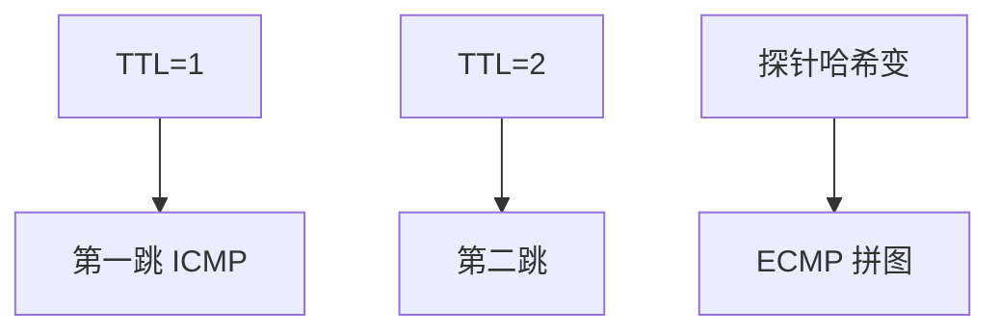

# TTL 与 traceroute

TTL/Hop Limit 每跳减一，到零则丢并 ICMP；traceroute 故意让它在沿途逐跳过期，画出一条（可能不对称的）路径快照。

<footer>—— 据 RFC 791 TTL；RFC 4443 ICMPv6；Van Jacobson traceroute 传统整理</footer>

主干[ICMP](/cs/icmp) 已有不可达类型。[上一课](/cs/pmtud) 用 ICMP 传 MTU。缺口是**用过期当探针**：traceroute 的 TTL=1,2,… 与 ECMP 下的多路径假象。本课结束域内与域间课序。

## 问题

环路时 TTL 防止包永生，接住距离向量病的数据面版本。traceroute：UDP/ICMP/TCP 探针，听 Time Exceeded。ECMP：每次探针哈希不同，画出的「路径」是多条边的拼接，不是一次流的路。MPLS：可能看到 ICMP 来自中间，标签栈影响返回。防火墙丢探针或限速，图残缺。

不要把 traceroute 当控制面：它看不见 BGP 政策意图，只看见当时数据面。

Paris traceroute 用稳定五元组对付 ECMP。本课钉对象。反向路径不对称常见。

### 图是快照

TTL 防环并支撑探针。ECMP 会把多条边拼成假路径。过滤 ICMP 与 PMTUD 黑洞同源。看不见 BGP 意图。

## 方法

画：TTL 1 到第一跳，2 到第二跳。对照 ping：ping 固定 TTL 测可达与 RTT，不画图。卫星第一跳 RTT 就很大，图仍短。

方法止于选定对象与对照；机制才说它如何嵌入已有分层与主干课。

## 机制

与 LLDP 对照：LLDP 一跳身份，traceroute 多跳 IP。与 BGP 收敛对照：路径在收敛中途会跳。RPKI 无效丢弃发生在边界，探针可能突然消失。VXLAN 外层 TTL 与内层独立，排障要看你 ping 的是哪一层。

安全：TTL 过期消息可泄露拓扑，有人过滤——于是与 PMTUD 黑洞同源。

## 边界

本课不引入 in-band OAM 的全部。路由器架构是下一课序第一课。后课默认：TTL 防环并支撑 traceroute；图是快照且受 ECMP 污染。

把 traceroute 当 SLA 监测不够：要固定流标识与数据面遥测。

上一课留下的缺口在本课收口；「TTL 与 traceroute」进入后课词汇表后只引用。文献用来钉对象与边界，不把本课写成该主题的独立综述。下一课[路由器架构](/cs/router-architecture)。

## 小结

- TTL 递减防环；零则 ICMP。
- traceroute 是逐跳过期探测。
- ECMP 与过滤使拓扑图不可直读。
- 后课只引用本课钉死的对象，不从该领域总问题重开。
- 出处：RFC 791；RFC 4443；Paris traceroute。
