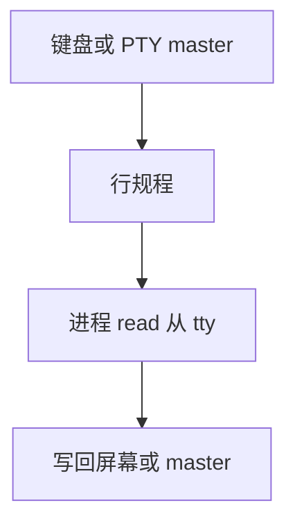

# tty 与 PTY

终端是带行规程的字符设备：规范模式处理擦除与行编辑；伪终端把同一套接口接到一对主从描述符。

<footer>—— 据 Ritchie and Thompson；Stevens and Rago, APUE；Linux tty 文档整理</footer>

[上一课](/cs/hrtimer)能做超时，shell 交互还缺「键盘与屏幕」这份文件。[信号](/cs/signals) 的 `SIGINT` 来自终端驱动。[进程组](/cs/process-image) 与会话（树里若已有）把前台作业接到控制终端。缺口是 **tty 行规程与 PTY**：不是硬件 UART 百科，而是内核对象如何把字节变成行、以及 sshd 如何用伪终端。

## 问题

若把串口当原始字节管道，退格、Ctrl-C、作业控制都要每个程序自己做。Unix：行规程插在驱动与 `read` 之间——规范模式攒一行再给进程，INTR 字符变成信号。PTY：没有真实串口，master 端像「对端键盘」，slave 端对进程就是 tty。缺口是这对对象，加上 `TIOCSWINSZ` 窗口大小。

本课不把 termios 的每一位 flag 背完。

会话的控制终端接收挂断信号。后台写终端可被 `SIGTTOU` 停。本课讲机制，不写如何抢 tty 做对抗。

## 方法

真实 tty：UART 中断 → 行规程 → 等待 `read` 的进程。PTY：用户写 master → 行规程 → slave 的 `read`；进程写 slave → master 的 `read`（给仿真器画屏）。`open("/dev/ptmx")` 取得一对。窗口改变投递 `SIGWINCH`。与 [VFS](/cs/vfs) 接头：都是字符设备 inode。

## 机制

tty 把「用户」接到进程组：中断字符是信号源，行编辑是内核里的小状态机。PTY 让网络与图形仿真器复用同一抽象，而不在内核里放 SSH 协议。不要把这写成 X11 或 Wayland 课。缓冲仍可能阻塞，select/epoll 对 tty fd 有效。

## 边界

本课不引入 systemd 的 getty 单元全文——init 课会接。不保证所有嵌入式没有 tty。下一课：这类驱动常常做成可加载模块，而不编进 vmlinux。

后课默认：交互式程序有 tty 语义。内核代码如何在运行时接上，下一课内核模块。

## 小结

- 行规程实现规范输入与终端信号。
- PTY 用主从描述符仿真同一接口。
- 可加载驱动是模块课的缺口。
- 出处：Ritchie and Thompson；Stevens and Rago, *APUE*；Linux tty。
