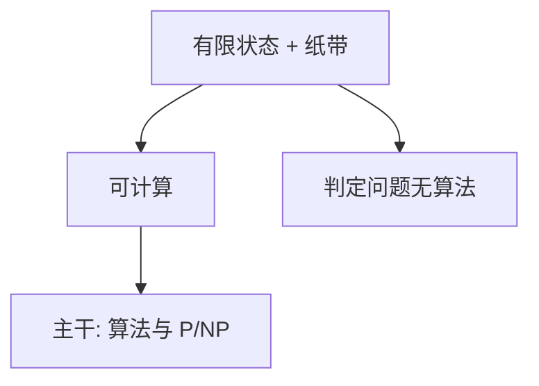

# Turing 可计算

把「一步机械手续」写成在无限纸带上的有限状态动作；不可判定随之成为定理，而不是口号。

<footer>—— Turing, On Computable Numbers, with an Application to the Entscheidungsproblem, Proc. London Math. Soc. 1936</footer>

[上一课](/cs/to-systems-boundary)（计算栈到此为止）。附录对照，不插入主干课序。主干已在[存储程序](/cs/to-systems-boundary)、[P 与 NP](/cs/p-vs-np)里用过「有限步骤的机械过程」与判定问题；这里对照 **Turing 1936 原文的问题**：希尔伯特判定问题能否有统一手续，以及用机器把「可计算」钉死。不重做停机证明的全部细节，也不把本篇插回比特课之前。

## 问题

主干从比特与指令走下来，默认「程序会停或我们可以不管停」。Turing 要的缺口是先定义**哪一类实数/函数算可计算**：有限状态、无限带、逐步读写。Entscheidungsproblem 是：一阶逻辑有效式有没有算法。原文的贡献是模型加否定答案，不是发明电子计算机。

Church 的 λ 可定义与 Turing 机事后被证明等价。主干算法课用的是 RAM/高级语言直觉；本附录只对照纸带模型如何让「手续」变成数学对象。

## 方法

机器：状态有限，带格是符号，转移是局部的。可计算数：小数位由机器依次写出。通用机：把转移表编码到带上，一台机器模拟另一台——主干[存储程序](/cs/stored-program)的观念亲戚，但 1936 还没有 EDVAC 的报告语言。停机、判定问题由此可以对角化。

## 机制

有了模型，后文才能说 P、NP、不可判定。主干[P 与 NP](/cs/p-vs-np)已经用多项式时间当资源；1936 还没有渐近记号课里的那一套，只区分「有手续 / 无手续」。通用机让「程序即数据」在数学上先出现，工程上的存放由下一篇 EDVAC 对照。

### 为何对照而不插入主干

若把 1936 插进比特课之后，读者会以为本栏第一课是可计算性。主干第一课是区分与编码；可计算性是算法课后段才需要的尺子。附录只对照原文如何把手续写成机器，以及主干停机/复杂性已经取走的那一层定义。

## 边界

不要把 1936 与 1950 年《计算机器与智能》混成一篇。也不要在附录里开递归论层级。下一篇对照 von Neumann 如何把存储程序写成工程草案。

本附录不重画有限自动机与正则——那是编译课词法。Turing 机比正则强，主干正则课不需要本篇插入。

停机问题的对角线与[P 与 NP](/cs/p-vs-np)的资源界限不是同一层：一个是有没有手续，一个是手续有多贵。

对照结束应回到主干[P 与 NP](/cs/p-vs-np)与[存储程序](/cs/stored-program)，而不是用纸带重讲 RISC-V。本篇不插入比特课之后。

## 小结

- 附录对照 Turing 1936：可计算 = 纸带上的有限手续；判定问题无解。
- 通用机是存储程序的数学亲戚，不是 EDVAC。
- 主干 P/NP 与存储程序课已取用观念，本篇不插入课序。
- 出处：Turing, 1936, *Proc. London Math. Soc.*。
