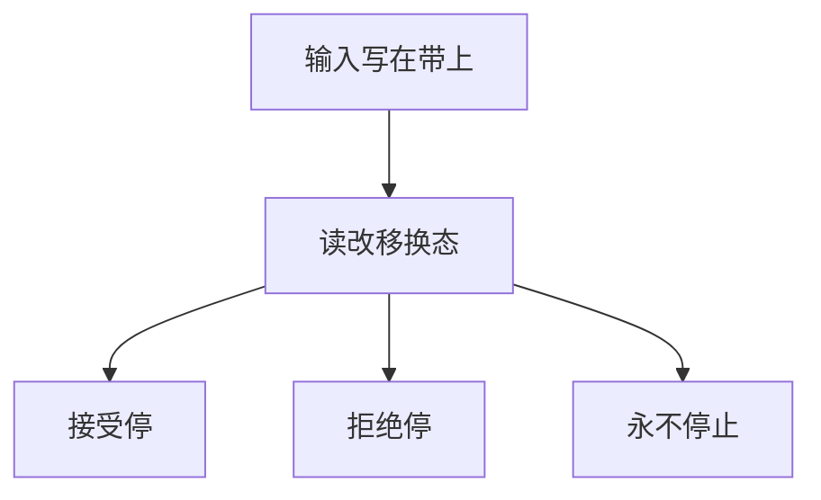

# 图灵机

有限控制器、一条无限格子带、一个读写头：每一步读格、改写、移一格、换状态；这是本补层对「过程」的标准模型。

<footer>—— 据 Turing, On Computable Numbers, 1936；Sipser 整理</footer>

上一课[CYK](/cs/cyk-parsing)把 CFL 成员关在多项式判定里。Chomsky 0 型还没有机器。缺口不是再加强栈，而是**图灵机（TM）**：带子可双向改写、可往复，语言类变成递归可枚举。本课只钉单带确定 TM 与识别的定义；变体与论题是后两课。

## 问题

PDA 的栈不能改写已经埋住的符号，也不能把输入当草稿。TM：$Q,\Sigma,\Gamma,\delta,q_0,q_{\mathrm{acc}},q_{\mathrm{rej}}$。带初始写着输入，其余空白。$\delta(q,a)=(p,b,D)$。三种结局：接受、拒绝、永不停止。识别 $L$：对 $w\in L$ 必停在接受；对 $w\notin L$ 可拒绝或循环。判定还要求总停，那是下一单元。

不要从[比特](/cs/bit-as-distinction)重讲存储：带格是字母表 $\Gamma$ 上的格子，已经是本课程第一课的串，只是长度在运行中可变。

### 图灵机不是「一台电脑」

Turing 1936 的对象是可计算实数与判定问题，不是操作系统。有限控制对应程序，带对应工作空间。时钟、缓存、进程都在主干系统栈，本课不请回来。

Turing 原文用「自动机」扫描方格。Sipser 的三结局是课堂标准。后课 Church–Turing 才把「任何算法」对齐到这一模型。

## 方法

写一台认 $\{a^nb^nc^n\}$ 的 TM：来回配对划掉，比 PDA 多的是能改输入。强调：存在 TM 识别，不等于我们能判定它是否对所有输入停下——那是停机问题。构造成表或状态图，本课不把 $\delta$ 的每一行写满。

主干组成课的[FSM](/cs/fsm-control) 是有限状态控制；TM 的新资源是无界可改写带。

## 机制

配置 $uqv$：状态、头位置、带内容（有限非空白）。一步关系在配置上。语言 $L(M)$ 是导致接受停的输入集。0 型文法与 TM 等价：生成对应枚举，识别对应半判定。本课登记，不写翻译。

时间、空间以后用「步数、扫过的格数」量；本课还没有复杂类。

空白符属于 $\Gamma\setminus\Sigma$，输入不含空白这一约定让「输入结束」可观察。双向移动使 TM 能把输入当草稿纸：划掉、改写、把计数搬到带的另一侧。PDA 做不到改写已经埋住的栈符号。三种结局里，循环不是「错误输出」，而是识别与判定的分界，下一单元才切开。

## 边界

本课不证停机不可判定，不引入多带，不谈 RAM 机。也不把 TM 当编程练习环境。后课默认：谈到识别，即某 TM 的 $L(M)$；判定要总停。下一课多带、非确定、双向无限带与单带等价。

## 小结

- 单带 TM：有限控制 + 可改写无限带；三种结局。
- 识别允许对否实例循环；CFL 做不到的语言从此可描述。
- 不是系统栈里的那台电脑。
- 出处：Turing, 1936；Sipser。
