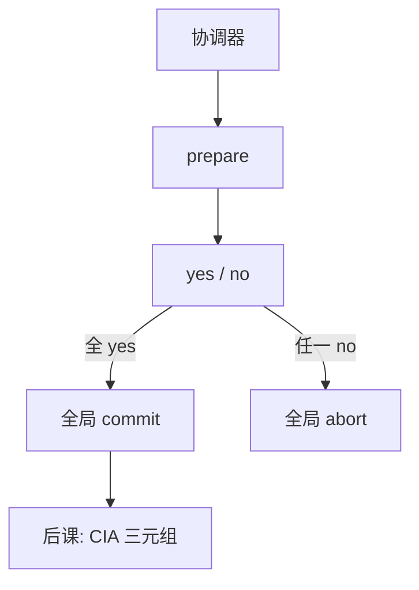

# 两阶段提交

先投票再决策：所有参与者同意才提交，否则全体撤；协调器的日志是分布式原子的支点。

<footer>—— 据 Lampson and Sturgis；Gray, Notes on Database Operating Systems；Bernstein 对 2PC 的整理</footer>

[上一课](/cs/wait-die)处理单库等待图。本课不重画环。缺口是：一次事务改了两个资源管理器（两库、库与消息队列），本地 ARIES 只能保证各自 A/D，不能保证**一起**提交或一起撤。两阶段提交（2PC）加一个协调器：准备阶段锁住并记下「可提交」，提交阶段统一决策。

## 问题

本地 commit 记录一刷盘，该节点已持久。若另一节点随后 abort，原子性跨节点失败。缺口不是再讲 WAL，而是协议：协调器收集 yes/no；全 yes 则发 commit，否则 abort。参与者在 prepared 状态必须等待决策，即使自己已经把 UNDO 信息钉在日志里——这是阻塞窗口，不是算法写错。

假设故障：宕机、丢消息，不是拜占庭。协调器自身崩溃必须靠其日志恢复决策，否则参与者永远 prepared。三阶段提交减阻塞，主干不替换 2PC 作为第一协议。

## 方法

阶段一：协调器写 prepare，问参与者。参与者若能保证以后既可 commit 也可 abort，则写 prepared 日志并答 yes。阶段二：协调器写全局 commit/abort 并通知。参与者按决策 REDO 或 UNDO，释放锁。本课不把 XA 接口细节当理论，只锁定这两次持久决策点。

## 机制

2PC 给的是崩溃故障下的原子性，不是隔离：各节点内部仍用 2PL/MVCC。prepared 期间锁不放，跨节点死锁与阻塞会放大上一课的等待图。协调器日志丢失且未复制，会出现「不知道该提交还是撤」的启发式窗口——工程上靠复制协调器或人工。本课与[网络](/cs/tcp-handshake)的可靠字节流不同：这里要的是全体一致的提交位，不是一条连接的字节序。

阶段一结束时参与者必须既能提交也能撤，所以 UNDO 信息与锁都还在。

## 边界

2PC 不防恶意节点，也不保密。正确提交的事务仍可能被旁路读走、被伪造端点——这正是安全课要从 CIA 另起的缺口。也不处理网络分区下的可用性格：CAP 式放松（Paxos 提交、Saga）是后话，不插入本栏主干为「下一课」。

参与者在 prepared 时崩溃，重启必须仍记得「我已答应」，否则全局原子性裂开——这仍是 WAL，只是多一个决策位。后课默认：分布式原子可以做到；保密、完整、认证尚未成为对象。

协调器是新的单点：它的日志丢了，参与者会卡在 prepared。复制协调器是工程补丁，不是 2PC 规格的一部分。

## 小结
- 2PC 给崩溃故障下的原子，不给拜占庭、不给保密。
- 后课 CIA：提交正确仍可泄密或被冒充。

- 单库死锁已处理；跨 RM 原子靠 2PC 的投票与决策日志。
- prepared 阻塞是协议的一部分；假设崩溃不是拜占庭。
- 提交正确仍可能泄密或被冒充，缺口交给 CIA。
- 出处：Gray；Lampson and Sturgis；Bernstein, Hadzilacos and Goodman。
