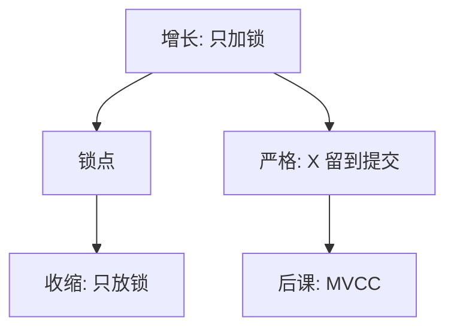

# 两阶段锁

先只加锁、后只放锁；增长阶段结束前不释放，调度就进不了冲突环。

<footer>—— 据 Eswaran et al., 1976；Bernstein 对 2PL 与严格 2PL 的整理</footer>

[上一课](/cs/rw-wr-ww)用冲突图定义合法交错。本课不重图画环。缺口是：运行时没有全局图可画完再执行，必须用锁协议**只产生**无环调度。两阶段锁（2PL）把每个事务切成增长与收缩；严格 2PL 把写锁留到提交，顺带挡住脏读与级联回滚。

## 问题

冲突可串行是事后判定。引擎需要可局部检查的规则：读前加 S、写前加 X，冲突锁互斥。若锁可以边放边再申请，仍可能环。缺口不是[锁与关中断](/cs/lock-irq)的自旋实现，而是事务级的**阶段**：增长期只申请，收缩期只释放。一旦进入收缩，不再申请，则 2PL 调度冲突可串行。

严格 2PL：所有 X 锁持有到 commit/abort。这比基本 2PL 更强，换可恢复、避免级联。实践默认这一档，而不是「一写完就放 X」。

## 方法

锁管理器按数据项（页、行、谓词）登记。兼容矩阵：S 与 S 兼容，X 与一切冲突。等待或立刻拒绝（后者配合死锁预防）。本课不展开多粒度意向锁的全部 IS/IX 表，只承认粒度为了少锁项；粒度太粗会误冲突。

## 机制

锁点（所有锁已拿到的时刻）给出一个串行序：按锁点排序与冲突图拓扑一致。这把隔离落实成等待。代价是阻塞与死锁——[库内死锁](/cs/db-deadlock)再收。读多写少时，读锁互相放行；写密集时队列变长。这与操作系统临界区同一互斥直觉，对象是数据项而非一段内核代码。

锁点给出的串行序是冲突等价序，不必等于墙钟提交序。

## 边界

2PL 不管持久化：没日志仍会丢提交。也不消除幻象，除非锁住谓词或间隙。本课不把 SI、SSI 当 2PL 的一种；那是版本与图的另一条实现。锁升级（行到表）是启发式，可能制造意外阻塞。

读写锁与更新锁（U）是兼容矩阵的加密，用来避免升级死锁，不改变两阶段。后课默认：谈到锁隔离，默认严格 2PL 可给出冲突可串行且可恢复；读多时可用版本减少读阻塞。

锁的粒度越细，并发越高、死锁与内存越贵。意向锁把多粒度收成可组合的矩阵，本课只要求知道有这一层。

## 小结
- 收缩阶段若提前放 X，脏读可以发生；严格 2PL 用提交当锁点。
- 后课 MVCC 用版本换掉读锁，写写仍要协议。

- 可串行是规格；2PL 是「只加后放」的运行时协议。
- 严格 2PL 把 X 留到提交，服务可恢复。
- 读阻塞与写锁冲突的另一条路，是 MVCC。
- 出处：Eswaran et al., 1976；Bernstein, Hadzilacos and Goodman。
