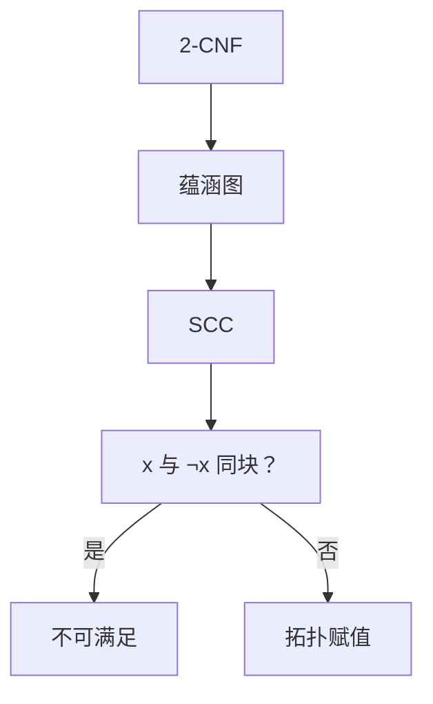

# 2-SAT

每个子句两个文字时，可满足性落到蕴涵图的强连通分量上：变量与其否定若同块则无解，否则按拓扑赋真假。

<footer>—— 据 Aspvall, Plass and Tarjan, A Linear-Time Algorithm for Testing the Truth of Certain Quantified Boolean Formulas, 1979；CLRS 第 22 章整理</footer>

上一课[强连通分量](/cs/scc-tarjan)给出线性 SCC 与缩点 DAG。主干[SAT 与 3-SAT](/cs/sat-3sat)把三元子句钉在 NPC。缺口是**二元子句**：$(x\lor y)$ 等价于 $(\neg x\to y)\land(\neg y\to x)$。把每个文字当顶点、蕴涵当有向边，SCC 决定可否满足。本课不重写 3-SAT 完全性，也不把 DPLL 请回来。

## 问题

2-CNF：子句皆二元（可含单文字，补假文字即可）。蕴涵图：顶点 $x$ 与 $\neg x$；子句 $(a\lor b)$ 加边 $\neg a\to b$、$\neg b\to a$。赋值使文字为真，当且仅当不沿蕴涵走到假。关键：若某 $x$ 与 $\neg x$ 落在同一 SCC，则无解；否则一定有解。

缺口是这层翻译，不是再跑一遍 Kosaraju 的证明。3-SAT 每个子句三个文字，没有「两向蕴涵」这种线性图；不要把本课算法套到 3-CNF。

### 赋值沿着缩点 DAG

可满足时：在缩点 DAG 上拓扑，若 $\mathrm{SCC}(\neg x)$ 排在 $\mathrm{SCC}(x)$ 之后则令 $x$ 真（或对称约定）。同一块内文字同真同假，故块内不能同时有 $x$ 与 $\neg x$。实现上常：若 $\mathrm{id}[x]\lt \mathrm{id}[\neg x]$ 则 $x$ 假，其中 `id` 为拓扑序编号。

Aspvall–Plass–Tarjan 1979 把 2-SAT（及若干带量词的变体）收到线性。Horn-SAT 另有单位传播多项式，本课不混。后课欧拉回路换对象：边的遍历，不是文字。

## 方法

建 $2n$ 个顶点。每条子句两条蕴涵。算 SCC。若存在 $i$ 使 $x_i$ 与 $\neg x_i$ 同块，输出不可满足。否则按缩点拓扑赋每个变量。总 $\Theta(n+m)$。

差分约束 $x_j-x_i\le c$ 化成边，可行当且仅当无负环——与本课不同图；本课只布尔。

## 机制

强连通意味着互相蕴涵：一块里一个真则全体真。$x$ 与 $\neg x$ 同块即推出矛盾。缩点 DAG 无环，故可以「先假后真」地沿拓扑放赋值，不会回头推翻。与[命题逻辑 CNF](/cs/propositional-logic-cnf) 的语义相同，算法换成图。

不要用随机赋值或分辨率当本课的主算法：正确但不是线性结构。

## 边界

本课不解 3-SAT、不解 MAX-2-SAT 的优化版（后者 NP-hard）。不写 QBF 的完整 APT 算法。后课默认：2-SAT = 蕴涵图 SCC。下一课问的是边能否一笔画，不是子句。

## 小结

- $(a\lor b)$ 变成两条蕴涵；SCC 里 $x$ 与 $\neg x$ 不能同块。
- 可满足则按缩点拓扑赋值，线性时间。
- 三元子句没有这张图。
- 出处：Aspvall, Plass and Tarjan, 1979；SCC 见 Tarjan, 1972。
