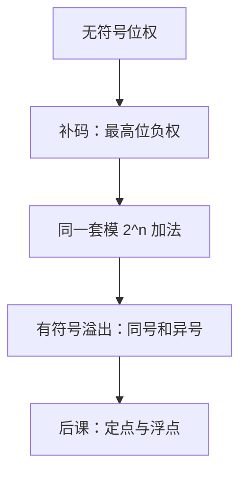

# 补码与溢出

把减法做成加法的办法是：给负数一张与加法环兼容的编码，而不是另造一套减电路。

<footer>—— 据 Patterson and Hennessy, Computer Organization and Design (RISC-V)；Harris and Harris, Digital Design and Computer Architecture 整理</footer>

上一课[Gray 码](/cs/gray-code)钉死了无符号位权与模 $2^n$ 加法。本课不重讲权怎么排，也不从「负数是什么」的公理另起。缺口是：同一套加法器要能算 $a-b$，并且知道何时结果已经不是那个数学整数。

## 问题

无符号集合 $\{0,\ldots,2^n-1\}$ 没有 $-1$。原码把最高位当符号、其余当幅值，加法和符号处理要分家，零还有 $+0$ 与 $-0$。缺口因此不是再发明一种基，而是选一种编码，使

$$
x + (-x)\equiv 0\pmod{2^n},
$$

并且硬件上「减 $x$」等于「加 $x$ 的编码」。$n$ 位补码把 $[-2^{n-1},2^{n-1}-1]$ 嵌进同一 $n$ 比特，最高位的权是 $-2^{n-1}$，其余位权仍为正。本课只钉这张表与溢出判定；小数还没有。

### 溢出不是进位

无符号加法的进位出最高位，表示模 $2^n$ 时丢掉了 $2^n$。有符号补码里，进位照样发生，但溢出是另一件事：两正数之和变成负，或两负数之和变成正。硬件用最高位进位与次高位进位的异或来抓它。把两者当成同一个旗标，后课的分支会判错。

Patterson/Hennessy 把补码加法与无符号加法画成同一套全加器，区别只在溢出怎么读。Harris 给出最高位权为负的位权解释。

## 方法

对 $n$ 位串 $x$，定义数值

$$
\mathrm{val}(x)=-x_{n-1}2^{n-1}+\sum_{i=0}^{n-2}x_i 2^i.
$$

取负：按位取反再加一，即模 $2^n$ 下的 $-x$。加法电路与上一课相同；解释改了，判定溢出的组合逻辑才改。RISC-V 的 `add` 不因溢出陷入，只按补码回写；比较则分有符号 `blt` 与无符号 `bltu`，同一比特、两种读法。那是后课 ISA 的缺口，本课只把两种读法分开。

## 机制

补码让 ALU 不必为减法另铺数据通路：减数取负后走加法。符号扩展是把最高位复制到更宽的高位，保持 $\mathrm{val}$ 不变；零扩展是无符号的读法。混用两种扩展，是后课调用约定里常见的宽度错误，根子在本课：扩展之前必须先说清读法。

可表示范围不对称：$-2^{n-1}$ 没有与它对等的正数。对这个值取负会溢出。这不是边角，是编码的几何。

## 边界

本课不引入饱和算术，不讨论标志寄存器里的进位、溢出、零、负如何锁存——那要等[锁存与触发器](/cs/latch-flipflop)和后课 ALU。也不把浮点的符号位当成补码：IEEE 754 的符号是原码风格，下一课定点还没讲完，更不预支。大模型栏的离散符号与这里的整数编码无关。

后课默认：谈到有符号整数，编码是补码；加法硬件与无符号共用；溢出按同号和异号判定。

## 小结

- 补码用最高位负权，把减法并进模 $2^n$ 加法。
- 溢出 ≠ 进位；有符号溢出是两操作数同号而和异号。
- 符号扩展保持补码数值；零扩展是另一套读法。
- $-2^{n-1}$ 取负溢出。定点与浮点是后课缺口。
- 出处：Patterson and Hennessy, COD (RISC-V)；Harris and Harris, *Digital Design and Computer Architecture*。
