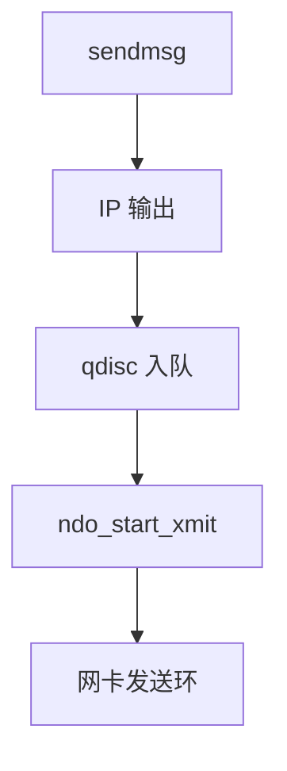

# 发送路径与 qdisc

qdisc 是设备出口的排队规则：FIFO、fq_codel、HTB 等在把 sk_buff 交给驱动之前做整形、分类与丢包。

<footer>—— 据 Linux tc 与 qdisc 文档；Gettys and Nichols 对 bufferbloat 的论述；Van Jacobson 对队列的背景</footer>

[上一课](/cs/rx-path)走到套接字。[sendfile](/cs/sendfile-splice) 从文件进 skb。缺口是 **TX**：`dev_queue_xmit`、流量控制、驱动 `ndo_start_xmit`，以及 bufferbloat 为何是队列问题。

## 问题

无队列：突发被网卡环丢。无限队列：延迟爆炸（bufferbloat）。qdisc：默认 pfifo_fast 或 fq_codel，按 band 或流公平排队，Codel 控延迟。缺口：BQL（字节队列限制）让驱动环不要堆太多；TC 分类器把 skb 送进不同 class；与 [blk 调度](/cs/blk-schedulers) 对照——一个整形包，一个整形 bio，不要混。本课不把 eBPF 分类器写成观测课。

锁：今日 xmit 常 per-queue；老的 `qdisc_lock` 是历史。GSO 在出队后切，避免 qdisc 按大包不公平。

## 方法

`sendmsg` → TCP 分段策略 → `ip_output` → POSTROUTING → `dev_queue_xmit` → qdisc `enqueue`。设备空闲则 `dequeue` 到驱动。拥塞：qdisc 丢或标记 ECN。对照 NAPI：TX 完成中断会 `net_tx_action` 再拉队列。对照 [cgroup](/cs/cgroups)：net_cls/net_prio 给 skb 打类。

## 机制

qdisc 把「共享出口」收成可策略对象：延迟、公平、限速。没有它，多流 TCP 会在驱动环里互相伤害。不要写成 ISP 计费。与 GRO：收侧聚合，发侧整形，方向相反。

失败：`ENOBUFS`/`EAGAIN` 在套接字层因 sndbuf 或 qdisc 满——下一课背压。

实现上：BQL 按完成速率限制驱动环字节，减轻 bufferbloat。GSO 包在出队后切，以免一个 64K 逻辑包占满 band。锁less 的 pfifo 适合极高 PPS 的内部口。 读法上只引用[上一课](/cs/rx-path)的结论，不把对象换成训练推理或限价簿。

本课在操作系统进阶的「网络栈 / 收发路径」课序里，对象是 **发送路径与 qdisc**。

- 先修只引用，不重导：上一课的结论当公理，本课只补差。
- 五栏不吞并：不把本课写成大模型训练/推理，也不写成限价簿或权重量化。
- 文献用 OSTEP、McKusick、内核文档与具名会议论文；不发明 arXiv 编号。

## 边界

本课不引入所有 HTB 层级实验。不保证无线 mac80211 的 qdisc 形状。下一课套接字自己的缓冲与窗口如何反过来压应用。

版本字段会变，课序钉的是机制对象「发送路径与 qdisc」，不是某一主线内核的结构体名。
后课默认：出口经 qdisc 再进驱动。sk 的 rcv/snd 缓冲如何限制未读/未确认字节，下一课。

## 小结

- TX 经 qdisc 整形再交给驱动。
- BQL 与 Codel 对抗无界延迟。
- 套接字缓冲与背压是下一课。
- 出处：Linux tc；Gettys/Nichols bufferbloat；Benvenuti。
