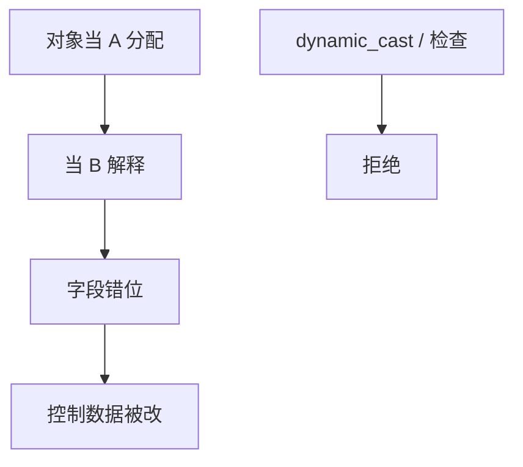

# 类型混淆

同一段内存按两种类型解释：字段对不齐，虚表是别人的。这在 C++ 向下转型与动态类型语言的桥接里反复出现。它不是栈邻接覆盖，却同样能到达控制数据。

<footer>—— 据 Szekeres SoK；CWE-843；对照浏览器引擎公开事故的机制陈述</footer>

## 定位

上一课[格式化字符串](/cs/format-string)是 libc 解释器。缺口是**对象类型**：混淆后读错字段宽度，函数指针槽被当成整数写。本课讲发生条件与防御（RTTI 检查、分区 GC），不给引擎利用步骤。

后课默认已经读完本课钉下的合同，只补差，不从该领域第一性原理重开。

## 问题

`static_cast` 当 `dynamic_cast` 用、union 错活跃成员、JIT 与对象模型不同步。缺口是类型安全与隔离堆（array/对象分槽）。

### 沙箱仍要假设有洞

浏览器后课把类型混淆当逃逸前奏。本课只在进程内。

CWE-843。本课禁止 PoC。Chrome 分区堆一类是工程缓解，点名。

## 方法

画：分配成类型 A，当成 B 用。防御：checked cast、隔离、内存安全语言。指向 CET/PAC 从硬件钉控制边。

图中节点是本课的机制骨架；课程不把图展开成可运行的攻击步骤。

## 机制

类型是空间安全的逻辑层。硬件缓解下一课从影子栈与 CET 钉返回与间接跳。

前提写进合同之后，游戏外的误用只当失败模式点名，不在本课写成操作程序。

## 边界

本课不分析某 CVE。影子栈与 CET 下一课。

## 小结

- 格式串是解释器；类型混淆是对象模型。
- 错类型解释可写到函数指针。
- 检查转型与隔离堆是缓解。
- 下一课影子栈与 CET。
- 出处：Szekeres et al.；CWE-843。
