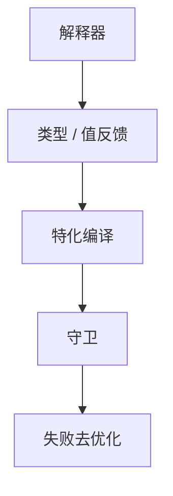

# 类型反馈与推测

解释器或 IC 记录操作数见到的类型（或范围），JIT 按最常见类型特化代码，其它类型走去优化。反馈是轮廓在类型上的投影。

<footer>—— 据 Hölzle and Ungar；Gal et al. 类型特化；对照[PGO](/cs/pgo) 与[渐进类型](/cs/gradual-typing) 整理</footer>

上一课[去优化](/cs/deoptimization) 提供失败通道。缺口是**投机依据**：类型反馈。`+` 在 JS 见过的都是 int，则发整数加，溢出或对象则 deopt。本课钉剖析数据结构，分层编译下一课用同一反馈升层。

## 问题

静态 HM 在动态语言上没有。运行时：每个字节码或调用点一个 profile（位图、类型链）。JIT 读 profile 生成守卫。缺口是**收集与消费**，不是 deopt 帧格式。

与渐进：静态注解是程序员；反馈是机器观察。可同时存在。

### 反馈不是证明

罕见类型没见到 ≠ 不会出现。必须守卫。不要删 deopt 路径。

Self/HotSpot 类型 profile。V8 FeedbackVector。本课与 PGO 对照：一个在线、一个离线。

## 方法

解释器更新计数（要廉价：饱和计数器）。编译：若单类型占 99% 则特化。Megamorphic 放弃。再编译：profile 变了则作废代码。

与值范围：反馈可含常见立即数，用于推测常量。与 IC：IC 状态本身是反馈。

## 机制

多线程：profile 更新竞态可接受近似。不要为精确用全局锁。污染：一个调用点见过太多类型则永远慢——可分裂调用点（克隆方法）。

与[SCCP](/cs/sccp)：静态常量 vs 动态常见值，后者必须检查。

## 边界

本课不写分层阈值数字。后课默认：动态语言 JIT 吃类型反馈。下一课分层编译：解释器 → C1 → C2。

也不把反馈当推荐系统。

## 小结

- 类型反馈：在线轮廓驱动特化。
- 必须保留去优化；反馈不是类型系统。
- IC 是调用点上的反馈。
- 出处：Hölzle and Ungar；Gal et al.；对照 PGO。
