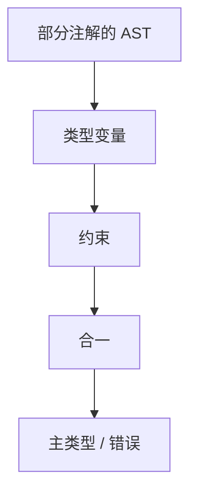

# 类型推导直觉

声明可省略类型时，从使用处列出等式，用合一解出最一般类型；检查是推导在注解已写满时的特例。

<footer>—— 据 Hindley, The Principal Type-Scheme of an Object in Combinatory Logic, 1969；Milner, A Theory of Type Polymorphism in Programming, 1978；龙书第 6 章整理</footer>

上一课[类型检查](/cs/typecheck)在声明带着类型、表达式综合再比对的规则下拒绝或放行。本课不重写算术规则。缺口是**注解不全**：`let` 绑定没有写类型，要从 `x+1` 与 `f(x)` 反推 $x$ 的类型。主干只要直觉：类型变量、等式、合一；Hindley–Milner 的 let 多态点名，不把 occurs check 证成论文。后课重载与强制在已解出的类型上再选声明。

## 问题

检查：已知 $e$ 应有类型 $\tau$，递归验证。推导：未知 $\tau$，生成 $\tau=\mathrm{int}$ 或 $\tau_1\to\tau_2$ 一类约束，解方程组。合一：两个类型表达式最一般的公共实例。失败则类型错误（无限类型、$int$ 与 $bool$ 冲突）。缺口是约束，不是再定义结构等价。

函数参数：引入新鲜类型变量，体里收集约束，返回类型也是变量或由 `return` 等式钉死。多态：在 `let` 处推广未被环境约束的变量，使用处再实例化。这是 Milner 的 let 多态；一等泛型更后，本课不启用。

### 推导不是「运行时猜」

仍是编译期。解不出来就拒绝，不生成带 tag 的解释器。动态类型语言不做本课这套等式。

Hindley 1969；Milner 1978（J.CSS）与 Algorithm W。Cardelli 综述可对照上一课。龙书以检查为主，推导作扩展。Appel 的函数式章用合一。本课不把 System F 写进主干。

## 方法

遍历 AST，为无注解节点分配类型变量。对每个运算符发出等式（两操作数合一、结果为规定类型）。`Unify` 带替换。结束时每个节点得到基类型或带量化的方案。

有注解则当等式的一侧已是具体类型，退化成上一课的检查。

## 机制

最一般类型（principal type）使同一 `id` 的推导结果可被所有合法使用共享。过早实例化会把 `id` 钉死成 `int->int` 而不能用于 `bool`。let 多态的规则就是为了这个。重载不在合一里：`+` 有多套规则，下一课先选再合一，或生成有限候选。

发生检查：变量不能合一到含自身的项，否则无限类型。点名即可。

## 边界

本课不写完整 W 伪代码，不做效果系统、生命周期。子类型合一更复杂（宽化），点名留给强制课。后课默认：缺注解可用约束求解；多声明同名或隐式转换是下一缺口。

## 小结

- 推导 = 类型变量 + 合一；检查是约束已写满。
- let 多态在绑定处推广；本课不引入 System F。
- 重载与强制不在合一内部解决。
- 出处：Hindley, 1969；Milner, 1978；龙书第 6 章。
