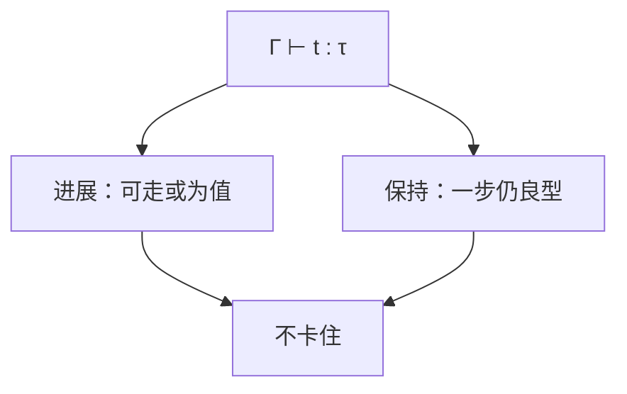

# 类型健全性

进展：良型项不是卡住的非值。保持：一步归约仍良型。合起来：良型程序不会达到「无法再走且不是值」的状态。

<footer>—— 据 Wright and Felleisen, A Syntactic Approach to Type Soundness, 1994；Pierce TAPL 第 8 章；Milner, 1978 整理</footer>

上一课[渐进类型](/cs/gradual-typing)靠运行时强制补洞。缺口是把本单元各系统的承诺收成**定理形状**：健全性。主干类型检查课是算法；本课是「算法在证明什么」。不重推 STLC 全部规则，只钉进展+保持，以及失败模式（未定义行为、`unsafe`、不健全渐进）。

## 问题

「不会出错」含糊。Wright–Felleisen：在操作语义上证。卡住：非值且无规则可应用（对 STLC 而言如把整数当函数用）。良型排除卡住。缺口是**这两个引理**，不是词法。

反例：C 的类型系统对缓冲区越界不承诺；Java 对 `null` 有例外——可把例外当定义的归约，仍「健全」但有陷阱。后课 Option 专门收空。

### 健全不是完备

健全：能型则行为遵守。完备：该能型的都能型。HM 对核心 Mini-ML 有主类型；加特设重载后常不完备。不要把二者当一句。

Wright–Felleisen 1994。Milner 的「well-typed programs cannot go wrong」。Pierce TAPL 把进展保持当标准作业。本课不证强规范化（STLC 另有），只点名它更强。

## 方法

先定值与一步 $\to$。证保持：对推导归纳。证进展：对推导归纳，应用情形用保持保证左件是 λ。加引用后须加存储分型。加并发须改「出错」定义（数据竞争可在模型里当未定义）。

与线性、借用：进展的「值」包含「不能再使用已移动的变量」——那些程序根本不井型。

## 机制

语义里若把越界当任意行为（C UB），则没有「卡住」可证，优化可把井型源程序变成任何东西——[未定义行为与优化](/cs/undefined-behavior-opt) 再展开。健全性定理必须先钉语言的对错状态。

渐进：强制失败是定义的归约（blame），仍可健全。

## 边界

本课不写并发内存模型全文。后课默认：健全 = 进展+保持（相对给定语义）。下一课把语义本身讲清：操作语义。

也不把测试覆盖当健全性证明。

## 小结

- 进展+保持 ⇒ 良型不卡住（相对所选语义）。
- 例外可编进语义；UB 则定理空洞。
- 健全≠完备。
- 出处：Wright and Felleisen, 1994；Pierce TAPL；Milner, 1978。
