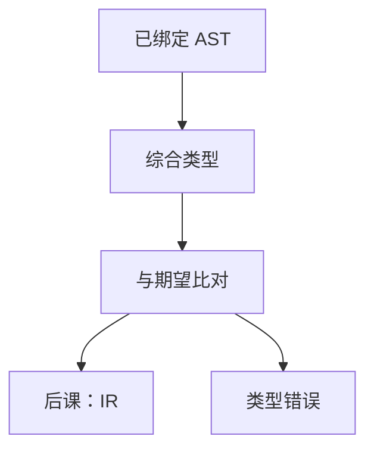

# 类型检查

每个表达式在绑定之后还有一个类型；运算符与赋值要求操作数属于规定的类型，否则程序不进入翻译。

<footer>—— 据龙书第 6 章；Cardelli, Type Systems, 1996 整理</footer>

上一课[名字解析](/cs/name-resolution)把名字绑到声明。本课不重做查找。缺口是：声明带着类型，表达式要**综合**出类型，并与上下文的期望**比对**。通过才交给 IR；失败则拒绝编译。本课只钉静态、简单类型（整数、指针、函数、数组），不写多态推断全文。

## 问题

绑定只回答「是哪一个 x」，不回答「x+1 是否合法」。算术、下标、调用、赋值各有规则。缺口是语法制导的类型规则：叶从符号表取，内节点由孩子类型计算。隐式转换若允许，必须写进规则，不能 silently 在后端出现。

[组成课的定点与浮点](/cs/fixed-and-float)说明表示不同；本课决定的是**语言层**的类型，不是 IEEE 编码。

### 检查不是「运行时 typeof」

静态检查在编译期拒绝一整类错误。动态类型语言把检查推迟，编译课主干仍生成需类型已知的 IR。本课不把解释器的 tag 当类型系统。

龙书 6.5 节类型表达式与结构等价/名等价。Cardelli 的综述把规则写成推导。本课用结构等价足够：数组与记录比字段。Hindley–Milner 不进主干。

## 方法

定义类型表达式。声明把类型写入符号记录。遍历 AST：二元运算要求两操作数一致（或可转换）；调用比较实参与形参； return 与函数返回类型。错误收集后可继续查，避免一次只报一个。

void、指针解引用、数组退化为指针按语言写清，不要混成「都是 int」。

## 机制

类型通过后，每个节点有固定类型，IR 生成知道宽度与符号性，[补码](/cs/twos-complement)的运算种类可选。重载决议在本课用类型选声明，符号表查找键含类型。

不健全的转换（强制转型）是显式节点，后课仍生成，但责任在源。

## 边界

本课不生成三地址、不做生命周期与借用。不证类型系统的进展与保持（那是 PL 理论附录）。子类型与接口只点名。后课默认：能进 IR 的程序类型正确。线性 IR 是下一课把树压成指令序列。

## 小结

- 类型在已绑定 AST 上综合与比对。
- 静态拒绝非法运算；转换为显式规则。
- 通过后宽度已知，供 IR 使用。
- 出处：Aho et al., 龙书第 6 章。
