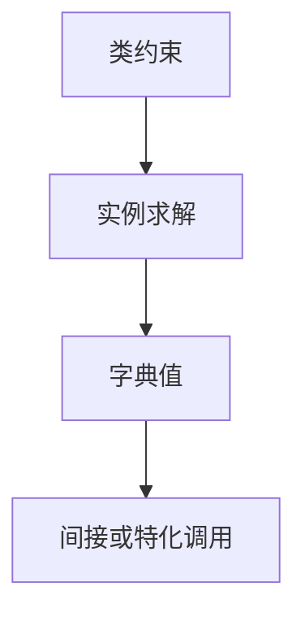

# 类型类与字典传递

类型类是谓词：$\mathrm{Eq}\,a$ 表示 $a$ 有一份相等字典。编译器把隐式字典当额外参数传，而不是靠名义继承。

<footer>—— 据 Wadler and Blott, How to Make Ad-hoc Polymorphism Less Ad-hoc, 1989；Peyton Jones 等 GHC 实现笔记；Pierce TAPL 对照整理</footer>

上一课[泛型实现](/cs/generics-monomorphization)把 $\forall$ 降到代码。缺口是**特设重载**：$==$ 在 `int` 与 `[a]` 上不同，却要同一套静态决议。类型类（Haskell）/ trait（Rust）给出约束；实现上常是**字典传递**：记录一组函数指针。本课钉决议与字典，不重写子类型的 $\lt :$。

## 问题

HM 不能表示 `==` 的无限族。类型类：`Eq a => a -> a -> Bool`。实例解析：根据调用处的 $a$ 找唯一实例（或重叠规则）。缺口是**隐式参数从哪来**，不是再写 W 的 let。

字典：`Eq a` 的值是 `{eq: a→a→Bool, ...}`。递归实例（`Eq a => Eq [a]`）对应字典的延迟/递归构造。单态化语言可把字典调用特化成直接调用。

### 字典不是 vtable 的全部 OOP

vtable 绑在对象头，方法以 `self` 为隐式；字典常绑在调用处的类型，不必有对象头。二者都是间接调用，身份不同。后课虚表再对照。

Wadler–Blott 1989。GHC 把类约束编译为函数参数。Rust trait 对象是字典+数据的胖指针，静态 trait 则单态化。本课以字典传递为主。

## 方法

类型检查：收集约束，用实例库求解（后向链）。失败：歧义（`show . read`）或缺实例。代码生成：给每个约束一个参数；调用 `eq` 变成 `d.eq`。

与[值限制](/cs/let-polymorphism)：多态约束的 let 仍要推广规则；字典本身是值。

## 机制

重叠实例使求解不确定，语言或禁或优先级。孤儿实例破坏模块化，工程上限制。连贯性（coherence）：同一类型同一类最多一份字典，否则优化（特化）会改变哪份 `eq`。

不要用类型类模拟全部依赖注入框架；它是编译期决议。

## 边界

本课不写 higher-kinded 的全部种类。后课默认：特设多态 = 约束 + 字典或特化。下一课 ADT 与模式匹配编译——数据侧，不再是隐式参数。

也不把 C++ ADL 与类型类等同，只点名都是重载决议家族。

## 小结

- 类型类约束在编译期求解，运行期常成字典参数。
- 与对象虚表：间接调用类似，分派键是类型不是对象头。
- 连贯性保证特化不改语义。
- 出处：Wadler and Blott, 1989；GHC 笔记；Pierce TAPL。
