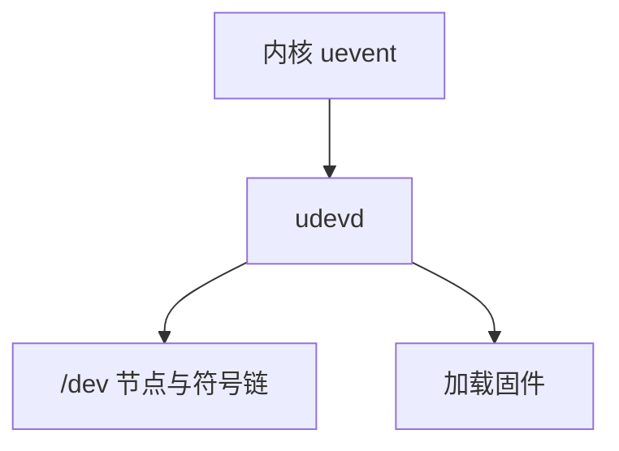

# udev 与热插拔

内核通过 uevent 把设备增删广播出去；udev 在用户态命名节点、加载固件、跑规则，而不把策略写死在内核。

<footer>—— 据 Linux hotplug/uevent 文档；systemd-udevd；[设备模型](/cs/device-model-binding) 为先修</footer>

[上一课](/cs/chardev-ioctl)留下的缺口接到本课。 [设备节点](/cs/device-nodes) 要有名字。[probe](/cs/device-model-binding) 产生 **uevent**。缺口是 udev：规则、`/dev` 动态、固件加载。

## 问题

内核发 netlink uevent。udev：匹配 ATTR、创建 `/dev/disk/by-uuid`、`RUN` 脚本。缺口：与 [initramfs](/cs/initramfs-pivot) 里的早期 udev；规则错误可改权限导致安全问题。本课不把所有规则写成发行版文档。

devtmpfs 先由内核造节点，udev 再改名/链。固件：`/lib/firmware` 经 sysfs 请求。

## 方法

uevent → udevd 匹配 → 节点与 systemd 设备单元。对照 [inotify](/cs/inotify)：一个文件树，一个设备树。对照 netns：udev 通常在初始 ns。对照 [SCSI](/cs/scsi-stack)：扫描完成才有盘事件。

## 机制

udev 把命名策略放用户态，内核只报事实。这是热插拔可管理的原因。不要写成桌面自动挂载广告。与 [LSM](/cs/lsm-selinux)：新节点的标签要规则配合。

风暴：USB 枚举可打满 udev 队列。

实现上：规则里的 NAME= 与 devtmpfs 冲突时以策略为准，写错会把盘节点改成不可预测的名字。固件加载失败则设备 probe 失败，表现为「没有网卡」。 读法上只引用[上一课](/cs/chardev-ioctl)的结论，不把对象换成训练推理或限价簿。

本课在操作系统进阶的「安全、启动与调试 / 内核安全与启动」课序里，对象是 **udev 与热插拔**。

- 先修只引用，不重导：上一课的结论当公理，本课只补差。
- 五栏不吞并：不把本课写成大模型训练/推理，也不写成限价簿或权重量化。
- 文献用 OSTEP、McKusick、内核文档与具名会议论文；不发明 arXiv 编号。

## 边界

本课不引入所有 TAG。不保证容器内 mknod 与宿主机 udev 的关系写完。下一课整机睡眠：挂起与恢复。

版本字段会变，课序钉的是机制对象「udev 与热插拔」，不是某一主线内核的结构体名。
后课默认：设备名由 uevent+udev 策略产生。休眠时驱动如何冻结，下一课 suspend。

## 小结

- uevent 出核，udev 命名并加载固件。
- 策略在用户态规则，不在驱动里写死。
- 挂起恢复是下一课。
- 出处：udev；uevent；systemd-udevd。
