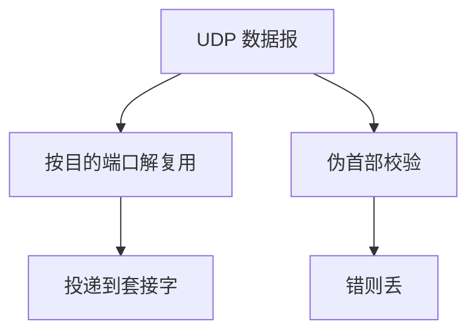

# UDP 校验与端口

端口把主机上的数据报交给某个套接字；校验和覆盖伪首部，发现的是端到端比特翻转，不是到达保证。

<footer>—— 据 Postel, RFC 768；Kurose and Ross 对端口与校验的整理</footer>

[上一课](/cs/udp)给出最薄传输：数据报、不保证序与到达。本课不重讲「无连接」。缺口是两个字段如何用：目的端口解复用到进程，校验和（IPv4 上可选、IPv6 上实质必有）把 [IP](/cs/ip-subnet) 地址绑进检查范围。本课不把 TCP 握手提前。

## 问题

[UDP](/cs/udp) 说有端口与可选校验，但没钉解复用键与伪首部。同一主机多个接收者：[进程](/cs/process-image) 用端口区分。校验覆盖 UDP 头、载荷以及源/目的 IP 等伪首部字段，使「改了 IP 头却不动 UDP」也能被发现——链路 [CRC](/cs/frame-crc) 覆盖不到中间节点改写。缺口是**解复用与端到端检错**，仍不是可靠流。

IPv4 校验和为 0 表示发送方未算。NAPT 改地址/端口后必须重算。分片重组前载荷可能不齐，校验在完整数据报上做。

## 方法

发送：填源端口（常由内核分配）、目的端口、长度，按 RFC 768 算校验。接收：按目的端口（及可选源过滤）投递；校验错则静默丢。无端口监听则 ICMP 端口不可达——那是上一层 ICMP 课已有的回报，UDP 自己不重试。

## 机制

端口是传输层名字，MAC 与 IP 都不是进程。[端到端](/cs/layering-e2e) 在这一层第一次有了「进程到进程」的检错，但仍无序号。后课 TCP 用同一端口空间的另一协议号，把校验、序号、握手叠在一起。套接字 API 更后才把端口暴露给 `bind`。

## 边界

本课不把 QUIC 的 UDP 复用提前写完，不引入全部知名端口登记表。可靠、有序的字节流如何同步初始序号，下一课三次握手。

后课默认：数据报能按端口投递，校验错则丢。要流语义，下一课 TCP。

## 小结

- 端口解复用到进程；校验含伪首部。
- 校验发现翻转，不恢复丢失。
- 有状态字节流从下一课握手开始。
- 出处：RFC 768；Kurose and Ross。
