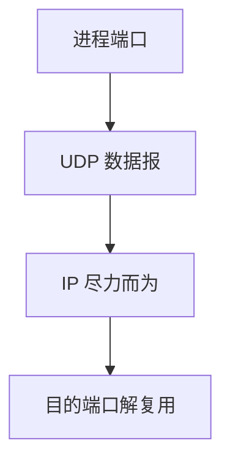

# UDP

UDP 只提供端口与可选校验和：把 IP 的主机到主机，延伸成进程到进程的数据报。

<footer>—— 据 Postel, RFC 768, User Datagram Protocol, 1980 整理</footer>

[上一课](/cs/bgp-policy)能把分组交到一台主机。[进程映像](/cs/process-image)上却跑着许多程序。[文件描述符](/cs/file-bytestream)还没有接到网络。缺口是传输层最薄的一种：**UDP**——端口、长度、校验和，不保证序与到达。本课不把 TCP 握手提前。

## 问题

IP 的协议号指向「哪一种传输」，但内核还要知道交给哪个套接字。16 位源/目的端口与四元组（后课 TCP 再加）标识端点。若在 UDP 里做可靠，每个应用重写一套——有人愿意（DNS、RTP），有人把可靠下放到 TCP。缺口是这个最小数据报服务，符合[端到端](/cs/layering-e2e)：不把文件语义塞进这一层。

本课不把 QUIC 在 UDP 上的复用写完。

校验和覆盖伪头（含 IP 地址），检测误投。IPv6 上 UDP 校验和不可全关。无连接：发送前不必握手。

## 方法

`sendto`：内核加 UDP 头，交给 IP。[ICMP](/cs/icmp) 端口不可达可回来，也可被过滤。MTU：UDP 不自动重传；分片由 IP（v4）或由应用避开。DNS 与 DHCP 已在前课出现，它们正是 UDP 载荷。

## 机制

UDP 把[套接字](/cs/socket-api)（后课）接到 IP，而不引入连接表。丢失、重复、乱序原样交给应用。拥塞：UDP 默认不减速，所以后课 TCP 友好与实时流量会冲突；本课只承认没有拥塞状态机。NAT 对 UDP 用超时表项，比 TCP 更易过期——接 [NAT](/cs/dhcp-nat) 课。

与管道对照：管道在单机内核缓冲里可靠；UDP 跨机，缓冲只在两端套接字，中间是网络。

## 边界

本课不引入 UDP-Lite 部分覆盖。不把 STUN/TURN 写成完整 NAT 穿越教程。可靠字节流、握手、重传是 TCP 三课的缺口；下一课先握手。

连接字面：`connect` 在 UDP 上只记下默认对端，并不握手。错误（ICMP）可以投递到该套接字。

校验和为 0 在 IPv4 表示不校验；静默错误会交给应用，这是薄传输的代价。

后课默认：进程可用端口收发无连接数据报。需要连接与可靠时，下一课 TCP 三次握手。

## 小结

- UDP（RFC 768）= 端口 + 可选校验，无握手无重传。
- 解复用到进程；可靠性按端到端留给应用或 TCP。
- 连接建立是下一课。
- 出处：RFC 768；Kurose and Ross；Tanenbaum *Computer Networks*。
