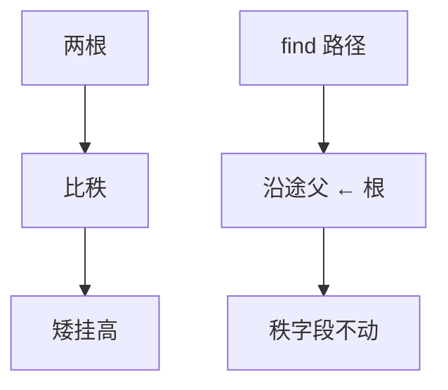

# 按秩与路径压缩

矮树挂到高树上，高度有对数顶；再把路上的点直接接到根，摊还才掉到反 Ackermann。

<footer>—— 据 Tarjan, Efficiency of a Good But Not Linear Set Union Algorithm, JACM 1975；Cormen, Leiserson, Rivest and Stein 第 21 章 整理</footer>

[上一课](/cs/union-find)已经给出父指针森林、`find`/`union`，并点名按秩加压缩、摊还 $\alpha(n)$，却把两条技术的不变式捆在一起。本课不重讲分区 ADT。缺口是把它们拆开：只按秩（或按大小）时高度 $O(\log n)$；只压缩时最坏仍可差；合在一起秩是高度上界且压缩不增加秩。图表示下一课要存边，本课仍不存边。

## 问题

朴素 union 把一棵树挂到另一棵根上，链长可以 $\Theta(n)$。按秩：根存一个整数 $\mathrm{rank}$，union 时秩小的根挂到秩大的；仅当两秩相等时赢家秩加一。不变式：$\mathrm{rank}[x]$ 不小于子树高度的一个上界，且沿父严格降。缺口是证明**秩一旦写出，压缩不得把秩改大**，否则上界烂掉。

路径压缩：`find` 把沿途节点的父改成根（两趟或递归返回时改）。深度变 1，但秩字段保持原值——它不再等于真实高度，只是上界。

只压缩不按秩，Tarjan 仍给出摊还界，但实现上两条都做几乎零成本。主干两者都开。

## 方法

`Link(x,y)` 两根：若 `rank[x]<rank[y]` 则 `parent[x]=y`；对称；相等则 `parent[y]=x`，`rank[x]++`。`Find` 压缩不改 `rank`。按大小合并把 `rank` 换成子树规模，挂小到大，无压缩时高度 $O(\log n)$ 同样成立。

调用方仍不得缓存旧根：压缩和 union 都会改代表。

## 机制

有了秩上界，一棵秩为 $k$ 的树至少 $2^k$ 个节点（归纳：秩加一发生在两棵同秩树合并）。故最大秩 $O(\log n)$，无压缩时 `find` 为 $O(\log n)$。压缩把已经付过的路径摊到以后的 `find`。$\alpha(n)$ 本课仍不展开定义：合同写成「摊还几乎常数，单次最坏可较长」。

与动态数组摊还不同：这里势能跟节点到根的距离、秩有关，Tarjan 的会计更细。邻接表课不需要这个势能。

## 边界

本课不引入可持久化、不支持删边。也不把 $\alpha(n)$ 写成最坏 $O(1)$。图若还要枚举边，并查集不够——下一课邻接表与矩阵。

后课默认：实现并查集时按秩（或按大小）加压缩都打开。要存边集，换图表示。

## 小结

- 按秩给出高度 $O(\log n)$ 上界；压缩不改秩字段。
- 合在一起摊还 $\alpha(n)$；代表仍会变。
- 边的布局是下一课邻接表与矩阵。
- 出处：Tarjan, *JACM*, 1975；Cormen et al. 第 21 章。
