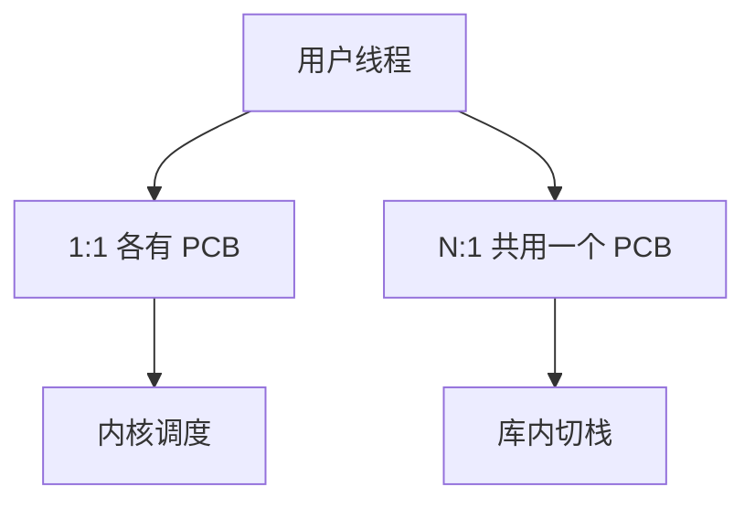

# 用户线程对内核线程

内核只能调度它看见的内核线程；用户级线程库在一条内核线程上自己切栈，阻塞一次系统调用会卡住整个库。

<footer>—— 据 Silberschatz et al., Operating System Concepts；Tanenbaum MOS 整理</footer>

[上一课](/cs/thread-shared-addr)钉死：同进程多条控制流共享页表，各有栈与寄存器。缺口是**谁来切换这些流**：若每条 POSIX 线程对应一个 PCB（1:1），内核全看见；若 N 条用户线程复用 1 条内核线程（N:1），内核只看见一个调度实体。本课对照这两种映射，不写具体绿线程库。

## 问题

1:1：创建线程就是再分配 PCB 与内核栈，阻塞 `read` 只挡这一条，其它内核线程仍跑。代价是每次用户切换都可能陷入。[上下文切换](/cs/context-switch) 对内核可见。N:1：用户库改栈指针即「切换」，快，但该内核线程一睡，全部用户线程停。M:N 要内核与库协同，复杂。缺口不是共享堆的定义，而是调度可见性。

当代 Linux 上的 NPTL 是 1:1。用户态协程仍存在，但阻塞系统调用要么包装成非阻塞，要么接受卡住工人线程。

## 方法

教学默认后续调度课调度的是内核线程（KLT）。提到 ULT 只为解释：库内切换不经过 trapframe 交换两个 PCB。混合模型里，内核提供若干工人 KLT，库把 ULT 绑上去；工人阻塞则库需再开工人——本课只点到，不设计调度器。

[系统调用路径](/cs/syscall-path) 总是由当前这条 KLT 陷入。ULT 的「当前」若与陷入的 KLT 不一致，库必须在陷入前记下。

## 机制

映射决定阻塞语义与并行度。多核上 N:1 无法把同一进程的线程真正并行到两颗 CPU——只有一个 PCB。1:1 可以。实时优先级也只作用在 KLT 上；纯 ULT 的优先级是库自己的假象。这把后课的运行队列对象钉死：队列里是 PCB，不是用户库的协程控制块。

## 边界

本课不把 Go 调度器或 Java 虚拟线程的实现写成 OS 主干。也不把 GPU warp 当线程模型。fork 与多线程的 POSIX 规则上一课已点过。

后课默认：内核调度实体是 KLT。同进程线程仍要有一份内核看不见的**每线程数据**（errno、locale），下一课讲线程局部存储。

## 小结

- 内核只调度 KLT；ULT 切栈快但阻塞会连坐。
- 1:1 才能真正多核并行同一进程的线程。
- 每线程私有数据槽是下一课 TLS。
- 出处：Silberschatz et al., *OSC*；Tanenbaum and Bos, *MOS*。
