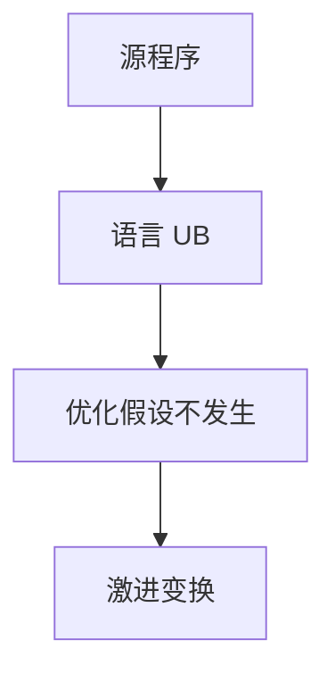

# 未定义行为与优化

语言把某些状态标成未定义，优化器可假设它们不发生。于是「程序员觉得会做什么」与「生成代码做什么」在 UB 处分裂。

<footer>—— 据 ISO C/C++ 未定义行为条款；Lattner, What Every C Programmer Should Know About Undefined Behavior；CompCert 对定义行为子集的对照整理</footer>

上一课[LTO](/cs/lto)让分析看见更多路径。缺口是**合法变换的上限**：有符号溢出、野指针、数据竞争（C）是 UB，优化可删检查、把循环当无限、根据「不能越界」收紧范围。本课钉「假设不发生」如何变成变换，不把全部 UB 列表当百科。中端课序在此收紧契约。

## 问题

[健全性](/cs/type-soundness) 相对「出错状态」才有意义。C 的出错是 UB，语义允许任何目标码。优化：`if (p) load p; load p` 第二次可提前，因空指针 UB。缺口是**把标准当许可**，不是区间格细节。

程序员用溢出当绕回，优化可删 `if (x+1<x)`。这是误解契约，不是编译器随机坏。

### UB 不是未指定或实现定义

未指定：选一种；实现定义：必须文档。UB：无要求。不要三词混用。

ISO C 3.4.3。Lattner 的系列短文。Regehr 的博客与 cse473 课常见材料。CompCert 选可定义子集。本课不发明标准条款编号之外的「秘密 UB」。

## 方法

IR 带 `nsw`/`nuw`/`inbounds` 等毒标志，把源语言 UB 显式化。变换：利用毒值传播、立即 UB 则后继不可达。诊断：sanitize（ASan/UBSan）在另一配置关闭这些假设。

与值范围、LICM、别名（TBAA）都吃同一口粮。fast-math 是浮点侧的类似开关，下一课。

## 机制

毒值 vs 立即 UB：LLVM 区分 poison 与 UB，避免「一条毒指令核掉整个函数」过激。语言律师与 IR 律师要对齐。不要在安全语言 IR 里默许 C 的 `nsw`。

LTO 使跨函数的 UB 假设传播更远，bug 表面更离奇。

## 边界

本课不写全部 sanitizer。后课默认：中端合法性 ⊂ 语言未定义之外的行为。下一课 fast-math：浮点契约的显式放松。

也不把 UB 当「可以生成病毒」的许可证来讲利用；本课只讲优化契约。

## 小结

- UB 让优化假设某些状态不可达。
- 源级「绕回」直觉与 C 有符号溢出冲突。
- sanitizer 与 `-fwrapv` 等改变契约。
- 出处：ISO C/C++；Lattner；对照 Leroy CompCert 子集。
