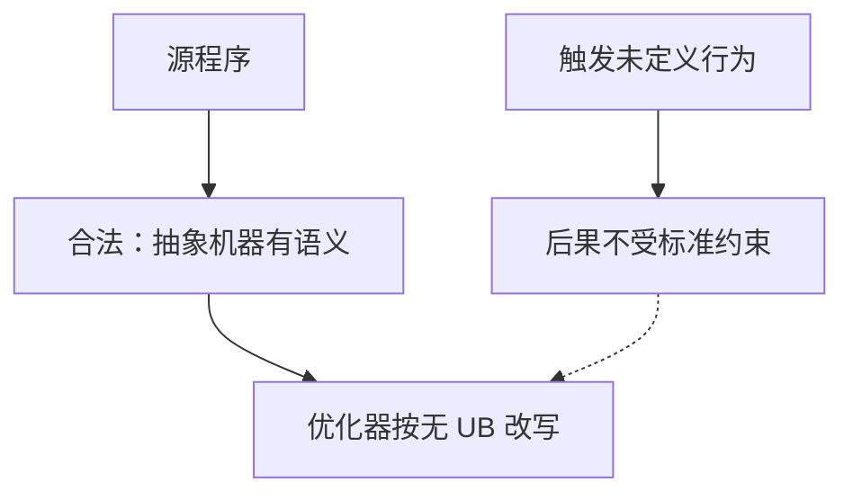

# 未定义行为

标准不规定后果的运算，编译器可以假定它从不发生；于是带未定义行为的程序在优化之后可以变成另一份程序。

<footer>—— 据 ISO/IEC 9899:2018；Kernighan & Ritchie, The C Programming Language, 2nd ed. 整理</footer>

上一课[递归与栈帧](/cs/recursion-stack-frame)把「一调用一帧、返回即失效」钉死。本课不重讲深度，也不从形式语义教科书另起。缺口是：栈溢出、越界下标、空指针解引用，在语言里是什么地位？**哪些写法根本没有语义，因而「在我机器上能跑」不能当规格**。

## 问题

ISO C 的抽象机器给合法程序逐步语义。一旦执行到未定义行为（UB），标准不再约束任何后果：崩溃、看似成功、删掉整段代码、跨翻译单元传播，都允许。缺口因此不是 bug 清单，而是**语言契约的方向**：程序员保证 UB 不发生，编译器才有权按「这事不会发生」做优化。违反之后，调试版本与发行版本分叉是常态，不是工具链坏了。

前面几课已经埋了火种：返回后的栈地址、未对齐强转、越出数组对象的指针。本课给它们一个总名，并分清旁边两个更容易混的词：未指定与实现定义。后两课再把整数溢出与悬挂指针从总名里拆开细讲。

### UB 不是「可能得错误结果」

未指定（unspecified）：必须在若干合法结果里选一个，例如参数求值顺序。实现定义（implementation-defined）：必须合法且写进文档，例如 `char` 是否有符号。UB 没有这种仁慈——有符号溢出后 `i+1 < i` 可以为真，编译器可以删掉你以为在「防溢出」的分支。把三类都叫做「平台相关」，后课的 sanitizer 与代码审查会对不准靶。

ISO C 附录 J 汇总未定义行为。K&R 年代许多习惯写法今天仍是 UB。地址与未定义行为 sanitizer 是工程上的探测器，它们不改语言规则，只让违规更早可见。

## 方法

判断顺序：先问是否离开对象寿命或对象边界，再问类型是否允许这样别名，再问算术是否在类型范围内。常见源：空指针或悬空指针解引用、越界、有符号溢出、违反有效类型的别名、数据竞争（C11 起对数据竞争也是 UB）。本课只建立分类；整数与寿命各用后面一课钉死。

「我看了汇编，这条 load 还在」不能证明程序合法：换优化等级、换链接时优化、换内联决定，同一源可能被改写成另一条路径。合法程序的可观察行为才是规格；UB 程序没有可观察行为可谈。

实现定义与未指定仍要求程序继续有语义，只是你不能把某一次观察写成可移植规格。例如移位负值、`char` 的符号性。写可移植代码就把这些当成不可用，除非接口明确依赖某份 ABI。UB 更狠：连「继续跑」都不必。后课两例——有符号溢出与悬挂——覆盖了算术与对象两条最常见的河。其余（严格别名、并发数据竞争）在出现相应对象模型时再点名，不在本课造清单。

## 机制

优化器利用「无 UB」做常量传播、消除所谓不可能的分支、重排访存。链接时优化把假设跨过翻译单元。于是一段在 `-O0` 下「能用」的越界循环，在 `-O2` 下可能被认定上界永远成立而删掉检查。这不是编译器恶意，是契约被打破后的合法改写。

安全编码规范（CERT C、MISRA）的核心策略就是禁止进入 UB 构造，用可移植的子集换回可预测性。那是工程边界，不是本课要另起的语言。

与错误码课将要出现的「合法失败」对照：返回 `-1` 仍在抽象机器里。UB 是连失败语义都没有。因此「检查 `i+1` 是否溢出」若写成有符号加法后再比较，检查本身可能已被优化掉。必须用更宽类型、无符号模运算或标准库的检查原语，在溢出发生前分支。sanitizer 在动态执行路径上插桩，覆盖不到的路径仍可藏 UB。后课整数与寿命只是把本课的总名拆成两条最常踩的河。

## 边界

本课不罗列附录 J 的每一条，也不讲 C++ 的更长清单。下一课[整数溢出](/cs/integer-overflow)专讲有符号与无符号的分岔。后课默认：UB 一旦发生即无保证；不能靠一次实测定义语义；sanitizer 辅助发现，不替代规范。

同一份源在不同优化等级下的分叉，应首先当 UB 线索，而不是去关优化。合法程序的可观察行为在抽象机器上不依赖「碰巧没删掉那次检查」。把 `-O0` 能跑当成规格，等于把实现残留写成标准。

## 小结

- 未定义行为让标准停止给出语义；优化器按「不会发生」改写程序。
- 它不同于未指定与实现定义；后两者仍在合法结果集合内。
- 越界、非法指针、有符号溢出是主干上最常见的源。
- 下一课把溢出从这条总规则里拆开。
- 出处：ISO/IEC 9899；K&R 对不可移植写法的警告。
