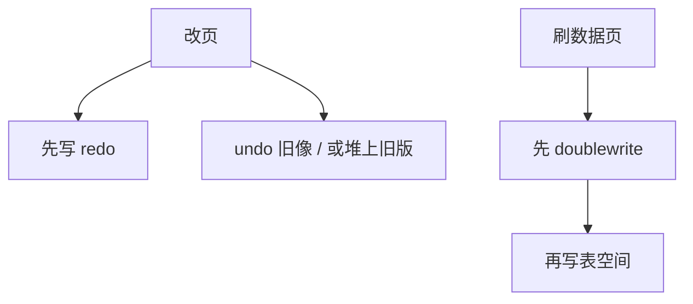

# undo / redo 与 doublewrite

redo 让已提交变更可重做；undo 让未提交可撤、让旧版本可读。doublewrite 先把页复制到连续区再写数据文件，对付半页撕裂。

<footer>—— 据 Mohan et al. ARIES；Gray and Reuter；InnoDB doublewrite 设计</footer>

[上一课](/cs/innodb-vs-postgres-storage)对照聚簇与堆。本课不选主键。缺口是日志角色拆开：主干 [WAL](/cs/wal) 已给先行协议；ARIES 直觉点到 UNDO/REDO。进阶对照 InnoDB 式 redo+undo 表空间，以及为何还要 doublewrite：页写入非原子时，恢复不能对半新半旧页做物理 redo。

## 问题

steal/no-force：脏页可先于提交落盘，提交可不刷数据页。redo：前滚已提交（及已刷脏的页上未刷的日志）。undo：回滚未提交，并给 MVCC 读旧版（InnoDB）。Postgres 堆把旧版本留在表上，undo 角色弱化，redo 仍在 WAL。缺口是**页撕裂**：4KB 原子写、16KB 页，断电可写到一半。checksum 失败后，若无完好副本，物理 redo 无法套在烂页上。

doublewrite：先把待写页批量写到共享 doublewrite 区（连续、较小），fsync，再写真正表空间。恢复时发现数据页坏则从 doublewrite 取。这是介质路径，不是另一种隔离。

ARIES 生理日志假定页要么旧要么已应用到某 LSN。撕裂打破假定。有的文件系统提供原子写或 reflink，可关 doublewrite。本课机制。

## 方法

InnoDB：redo 环文件；undo 段存旧行版本与回滚链。Postgres：WAL redo；堆上行版本+vacuum 回收。两者都要检查点限定 redo 起点。模糊检查点后课。

关闭 doublewrite 只在确认页原子写时。压缩/加密页同样要撕裂保护。

## 机制

MVCC 读：InnoDB 可能沿 undo 链回溯；Postgres 在堆上看 xmin/xmax。性能：undo 链过长像索引回表放大——后课 GC。doublewrite 增加顺序写，吞吐换正确性。

复制：物理复制传 redo；逻辑复制解行可能用 undo 构造前像。CDC 课。

## 边界

本课不讲 Postgres vacuum 冻结。也不把影子分页当 ARIES 替代——更后课对照。CLR 在 ARIES 三阶段课。

后课默认：redo 保提交，undo 或堆版本保回滚与旧读；撕裂用 doublewrite 或原子页。Postgres 元组版本与 vacuum：堆上 MVCC 的回收。

没有完好页，生理 redo 无处落脚。

## 小结

- redo 前滚，undo/堆版本回滚与旧读。
- doublewrite 修复非原子页写。
- Postgres vacuum 下一课：堆版本回收与冻结。
- 出处：ARIES；Gray and Reuter；InnoDB doublewrite。
