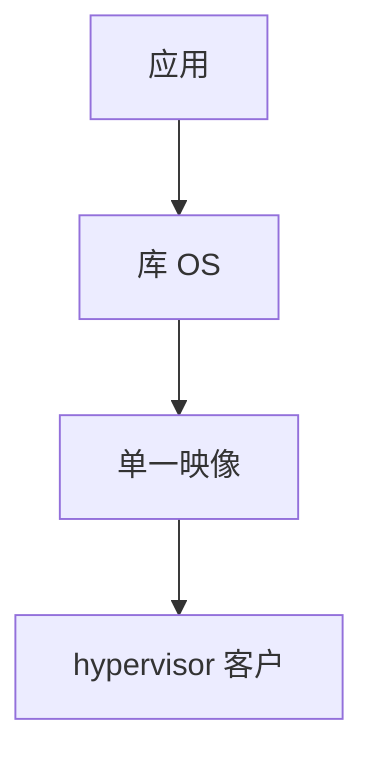

# unikernel

unikernel 把应用与仅需的库 OS 链成单一地址空间映像：无用户/内核切换，设备是库，部署常在 hypervisor 上当客户。

<footer>—— 据 Madhavapeddy et al., MirageOS, ASPLOS 2013；[用户内核分裂](/cs/user-kernel-split) 为对照</footer>

[Kata](/cs/kata-containers) 仍跑完整 Linux。[Firecracker](/cs/firecracker-microvm) 客户仍是通用内核。缺口是 **单地址空间库 OS**：unikernel。

## 问题

无系统调用门：`read` 是函数。缺口：调试、多进程、Linux ABI 兼容差；安全靠 hypervisor 而非用户/内核。本课不把每个项目（Mirage、IncludeOS、OSv）写成目录。

语言运行时（OCaml/Rust）常一起裁。对象是链接形态，不是微内核 IPC。

## 方法

应用 + 协议库 + virtio 前端 → 单 ELF → KVM 加载。对照 gVisor：一个模拟 syscall，一个消灭 syscall。对照 [DPDK](/cs/dpdk-kernel-bypass)：都在用户（或单空间）处理包。对照 runc：无多进程模型。

## 机制

unikernel 用链接时裁剪换攻击面与启动，适合专用网关。通用 POSIX 应用难迁。不要写成万能。与 [capabilities](/cs/linux-capabilities)：无进程模型则无 cap。与 [audit](/cs/kernel-audit)：要自己打日志。

一个库漏洞即全部特权，因无用户/内核裂。

实现上：没有多进程就没有 fork/exec 模型，监控要另做。调试靠 hypervisor 串口。virtio 前端仍常保留，因为部署在 KVM 上。 读法上只引用[上一课](/cs/kata-containers)的结论，不把对象换成训练推理或限价簿。

本课在操作系统进阶的「虚拟化与隔离进阶 / 容器与内核形态」课序里，对象是 **unikernel**。

- 先修只引用，不重导：上一课的结论当公理，本课只补差。
- 五栏不吞并：不把本课写成大模型训练/推理，也不写成限价簿或权重量化。
- 文献用 OSTEP、McKusick、内核文档与具名会议论文；不发明 arXiv 编号。

## 边界

本课不引入所有 xen mini-os。不保证热更新。下一课微内核：L4/seL4。

版本字段会变，课序钉的是机制对象「unikernel」，不是某一主线内核的结构体名。
后课默认：应用可与库 OS 链成单映像。IPC 微内核与证明，下一课 seL4。

## 小结

- unikernel：单地址空间，syscall 变函数调用。
- 靠 hypervisor 隔离多租户。
- 微内核 seL4 是下一课。
- 出处：MirageOS ASPLOS 2013；库 OS 文献。
