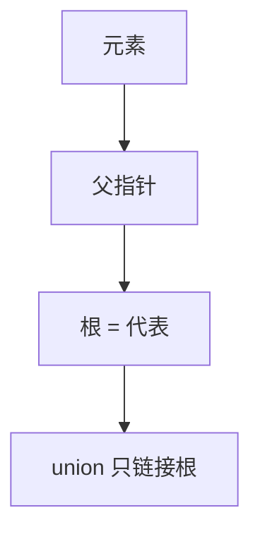

# 并查集

元素分在若干不相交集合里，只问是否同类、以及把两类合并；路径压缩加按秩合并以后，摊还几乎是常数。

<footer>—— 据 Tarjan, Efficiency of a Good But Not Linear Set Union Algorithm, JACM 1975；Cormen, Leiserson, Rivest and Stein 整理</footer>

[上一课](/cs/radix-tree)按键的符号结构存放。[抽象数据类型](/cs/adt-cost)允许合同里没有「按值查找」。[摊还分析](/cs/amortized-analysis)已经准备好势能语言。[图的定义](/cs/graph-definition)里连通分量是分区。本课不重讲前缀。缺口是分区 ADT：`find` 与 `union`，表示用父指针森林，分析用摊还，不是期望散列。

## 问题

维护 $\{1,\ldots,n\}$ 的划分。查询 $a,b$ 是否同一块，或把两块合成一块。用 BST 集合存每块，union 要搬元素。缺口是：**每元素一个父指针，根为代表；union 只改根；find 沿父走到根**。朴素则树可变链，$\Theta(n)$。按秩（或按大小）合并限制高度；路径压缩把沿途点直接挂到根。

Tarjan 证明压缩+按秩的摊还是反 Ackermann $\alpha(n)$，实际等于常数。本课不把 $\alpha$ 的定义展开成数论，只钉「比 $\log$ 还扁的摊还」。

并查集不给出块内元素列表（除非另存）。合同极窄，所以才能极快。

## 方法

`MakeSet(x)`：父为自己，秩 0。`Find(x)`：递归或两趟压缩。`Union(x,y)`：比两根的秩，矮挂高，相等则升一方之秩。

与链表表示的「按大小合并」同类：总是把小块挂到大块，无压缩时高度 $O(\log n)$。压缩再把已经走过的路摊掉。

## 机制

Kruskal 最小生成树把边按权加入、用并查集检测是否成环——算法课再用，本课只交结构。动态连通性若还要删边，并查集不够，合同不含 split。`find` 的返回值只作代表，代表编号可以随 union 改变，调用方不得缓存过期根。

表示是数组 `parent[i]`，局部性好于树节点堆分配。秩数组并行。这是[数组与随机访问](/cs/array-random-access)作为内部表示，对外仍是分区 ADT。

## 边界

本课不引入可持久化并查集、不处理并查集上的删除。也不把 $\alpha(n)$ 写成 $O(1)$ 最坏——最坏单次仍可较长，摊还小。

后课默认：不相交集合查询用并查集。图要存边而不只是分量时，需要邻接表示。

## 小结

- 分区 ADT：find / union；森林 + 压缩 + 按秩，摊还几乎常数。
- 不支持列成员、不支持删边。
- 图的边集怎么放，下一课邻接表与矩阵。
- 代表编号可随 union 改变；调用方不得缓存过期根。
- 出处：Tarjan, *JACM*, 1975；Cormen et al. 第 21 章。
