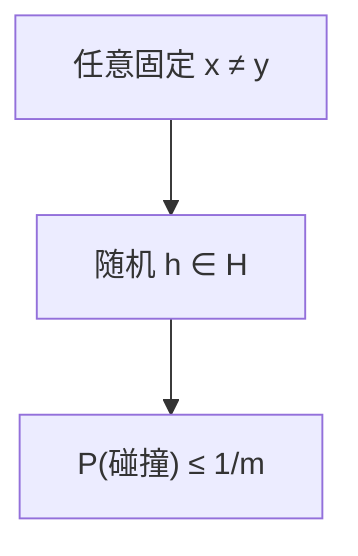

# 通用散列

函数从族里随机抽：任意一对不同键碰撞的概率 $\le 1/m$；最坏输入对期望仍然成立。

<footer>—— 据 Carter and Wegman, Universal Classes of Hash Functions, JCSS 1979；Cormen, Leiserson, Rivest and Stein 第 11 章整理</footer>

[上一课](/cs/art-adaptive-radix) 结束字符串结构。主干[散列碰撞](/cs/hash-collision) 已说明固定 $h$ 可被对抗。[字符串哈希](/cs/string-hashing) 用了随机模，未给族的定义。本课不画 ART 节点。缺口是 Carter–Wegman 通用散列：期望分析的合法前提。

## 问题

链地址、布隆、草图都要「碰撞不多」。对手若知道 $h$，可构造全撞一槽。通用族 $\mathcal{H}$：对任意 $x\neq y$，

$$
\Pr_{h\in\mathcal{H}}[h(x)=h(y)] \le 1/m
$$

（$m$ 为槽数）。强通用（pairwise independent）还要求任意两槽对均匀。缺口是**把随机性放在选 $h$，而不是假设输入随机**。

Carter and Wegman, *JCSS*, 1979。多项式、乘法散列 $h_a(x)=\lfloor m(ax\bmod 2^w)/2^{w-d}\rfloor$ 等是常见构造。CLRS 第 11 章。

## 方法

实践：程序启动抽 $a,b$，线性 $((ax+b)\bmod p)\bmod m$。证明两键碰撞化为一次均匀。多重独立（$k$-wise）给更好尾界，Count-Min 后课用。本课只钉 pairwise 级。

与密码学哈希：通用散列不要求原像困难，只要碰撞概率；更快、键更短。不要混用 SHA 当布隆的 $k$ 个索引——可以，但过重。

## 机制

期望链长：对固定键集，期望 $\alpha$ 与简单均匀假设相同，但现在对对抗输入也成立（期望对 $h$）。再散列换 $h$ 即换族中另一员。实现须真随机种子，不能写死 $a=31$。

完美散列下一课在通用之上再消除碰撞（静态）。

## 边界

本课不把有限域全部构造写完。一致性哈希解决的是槽增减，不是碰撞界。不要把本课写成 Transformer 位置编码。

后课默认：字典分析用通用族。静态零碰撞用完美散列。

## 小结

- 通用族：任意一对碰撞概率 $\le 1/m$。
- 随机在函数，不在数据。
- 静态无碰撞字典是完美散列。
- 出处：Carter and Wegman, *JCSS*, 1979；Cormen et al.。
