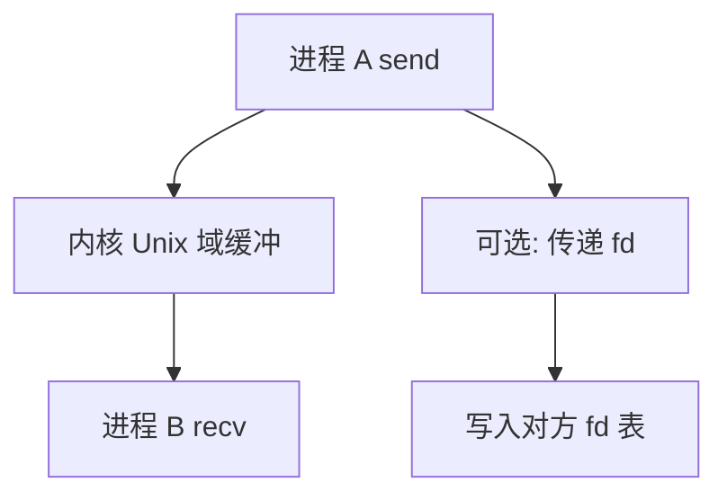

# Unix 域套接字

AF_UNIX 在同一台机器上提供套接字语义：流或数据报、连接或会合，并可传递文件描述符与凭据。

<footer>—— 据 Stevens, UNIX Network Programming；POSIX 对 AF_UNIX 的整理</footer>

[上一课](/cs/named-pipe)只有单向字节流。[文件作为字节流](/cs/file-bytestream) 与 [socket](/cs/socket-api) 课（网络栏）会共用 fd，但网络课还没开始。缺口是**本机套接字**：命名可以是文件系统路径或抽象名，不必有端口与 IP。把「像管道但更富」合并进一课，不当百科。

## 问题

FIFO 不能一次 `send` 保留消息边界，不能把已打开的 fd 交给对方，不能方便地做双向。`socketpair` 给出匿名的一对 Unix 域套接字，像双向 pipe。`bind` 到路径则像命名 FIFO，但协议是套接字：`listen`/`accept` 或 `SOCK_DGRAM`。缺口不是 TCP 握手，而是本地传输：内核把缓冲从发送方拷到接收方，可附带 `SCM_RIGHTS`（传 fd）与凭据。

本课不把每个 `cmsg` 头写成手册。

传 fd 是把打开文件表项在接收进程里再占一槽，指向同一打开文件对象。这不是复制文件内容。本课讲机制，不讲利用泄露的 fd。

## 方法

`socket(AF_UNIX, SOCK_STREAM, 0)`，`bind`/`connect` 走 [路径查找](/cs/path-lookup) 或抽象命名空间。数据仍是内核缓冲，不经网卡，不经 [IOMMU](/cs/iommu)。关闭语义类似套接字：半关闭可以。权限：路径受目录模式约束；凭据让接收方看见对端 uid。

## 机制

Unix 域把网络栏将出现的套接字 API 先落在本机，让桌面总线、数据库本地连接不必绕 lo 接口。与管道对照：同一隔离（地址空间仍分开），更富的控制面。不要提前讲 TCP 拥塞。共享内存下一课会把载荷从拷贝改成映射。

## 边界

本课不引入 `SOCK_SEQPACKET` 的全部保证当必考。不把 Linux 抽象命名空间的 `@` 前缀写成唯一实现。下一课：双方映射同一物理页，字节不再经内核拷贝。

后课默认：本机已有富 IPC 套接字。大块共享、需自行同步，下一课 POSIX 共享内存。

## 小结

- AF_UNIX 提供流/数据报与可选传 fd、凭据。
- 数据走内核拷贝，不经网络栈。
- 共享物理页是 posix-shm 的缺口。
- 出处：Stevens, *UNP*；POSIX AF_UNIX；Tanenbaum *MOS*。
