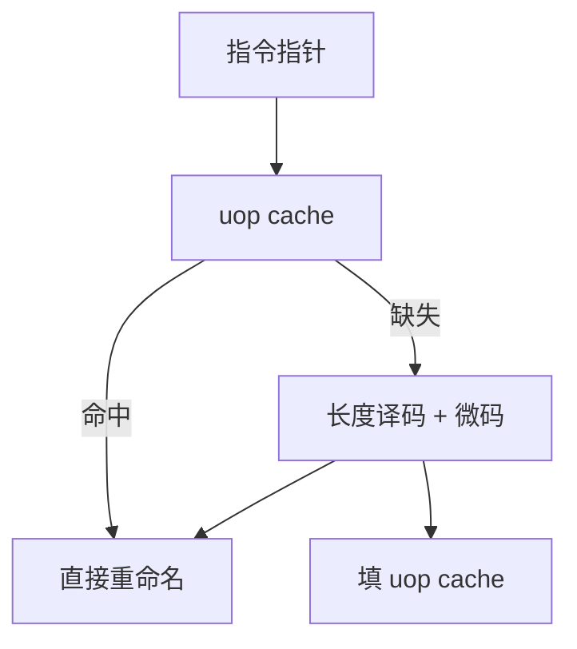

# 微操作缓存

变长宏指令译成定长微操作的代价很高；把已经译好的 uop 按热路径存起来，命中时取指不再走长度扫描。

<footer>—— 据 Rotenberg, Bennett, and Smith, Trace Cache, MICRO 1996；Intel 对 uop cache 的公开描述 整理</footer>

[上一课](/cs/fetch-decode-width)把前端带宽钉成供给上限，并点名变长译码是热点。本课不重做边界扫描。缺口是：**用一块小的、按 uop 组织的 cache 记住最近译过的指令，命中则绕过传统译码器。**

## 问题

x86 核每拍要给重命名输送 4–6 个 uop，长度译码与微码协助在频率上很痛。热循环可能只有几十条宏指令，却被反复译码。缺口不是再加一条预译码流水，而是**把「PC → uop 序列」缓存下来**，用 SRAM 命中代替组合译码。

Trace cache 存的是动态执行痕迹，可跨越宏指令与分支。Intel Sandy Bridge 起公开的 DSB（decoded stream buffer / uop cache）更接近「按 IP 对齐的已译码 uop」，命中则 MITE 译码器睡觉。

## 方法

uop cache：索引取自指令指针（可虚拟），行内存若干 uop、下一块指针、是否以分支结束。命中：每拍从该结构弹出最多 $D_{\text{uop}}$ 个已译码 uop 进重命名，I-cache 与长度译码不参与。缺失：走普通取指/译码，填入 uop cache。自修改代码或 icache 作废时同步清空。

与 I-cache 的包含关系：uop cache 是译码后的旁路，不替代指令页的一致性；SMC 必须两边都看到。

## 机制

前端 CPI：热路径上译码器功耗与延迟下降，有效 $D$ 接近 uop 端口宽度。冷路径、巨函数、以及 uop 行装不下的超长指令序列仍走慢路径。容量以 uop 计，不是字节：一条复杂宏指令可能占多个槽，反而降低密度。

与[分支预测](/cs/gshare-predictor)：uop 行往往在预测分支处截断，预测准才能连续弹出。误预测仍冲刷，只是重填可能再次命中 uop cache。

## 边界

本课不把循环流缓冲当成 uop cache 的子集讲完——LSB 是「锁定一个循环的 uop 流」，下一课。也不把 GPU 的指令 cache 写成 uop cache。微码 ROM 仍服务极少见的复杂指令，不进热 cache。

后课默认：热路径可以不经宏指令译码器。更小、锁定的循环还可以连 cache 标签比较都省掉。

## 小结

- uop cache 缓存已译码微操作，绕过变长译码。
- 命中率取决于热路径大小与分支截断。
- 把循环锁定在更浅的缓冲里，是下一课 LSB。
- 出处：Rotenberg et al., *MICRO*, 1996；Intel 微结构公开文档中的 DSB。
