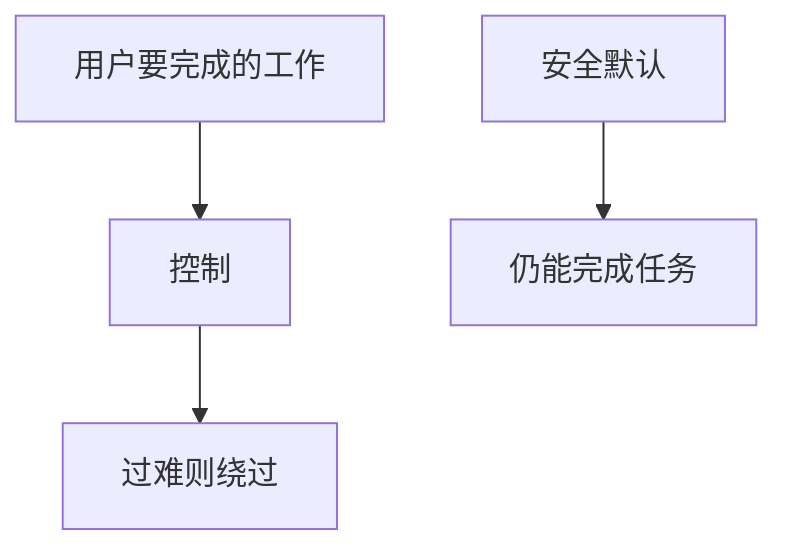

# 可用安全

用户会绕过使他们无法完成工作的控制。Whitten 与 Tygar 表明：密码学 UI 失败则密钥管理失败。安全必须是默认且可完成的任务，而不是考试。

<footer>—— Whitten and Tygar, Why Johnny Can't Encrypt, USENIX Security 1999；对照 Anderson 对操作</footer>

## 定位

上一课[安全经济学](/cs/security-economics)是组织激励。缺口是**个人操作**：警告疲劳、证书对话框、MFA 摩擦。本课可用安全。

后课默认已经读完本课钉下的合同，只补差，不从该领域第一性原理重开。

## 问题

点击「继续」绕过证书错误，链验证课白做。缺口是：默认安全路径、清晰失败、减少警告。

### 钓鱼

可用不等于无钓鱼。WebAuthn 绑 origin 是设计，不是再教育用户看 URL。

Johnny 1999。风险量化下一课试图给决策数字。

## 方法

对照警告疲劳。设计：安全默认、少问。下一课风险量化。

图中节点是本课的机制骨架；课程不把图展开成可运行的攻击步骤。

## 机制

人是系统一部分。量化下一课给管理层优先级，仍要可用。

前提写进合同之后，游戏外的误用只当失败模式点名，不在本课写成操作程序。

## 边界

不嘲笑用户。风险量化下一课。

## 小结

- 激励之后，个人会绕过难用的控制。
- Johnny：加密 UI 失败即密钥失败。
- 安全默认优于更多对话框。
- 下一课风险量化。
- 出处：Whitten and Tygar, 1999；Anderson。
