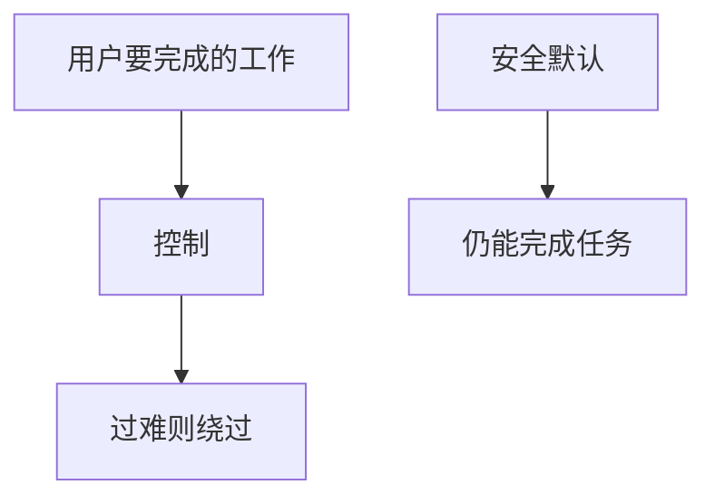
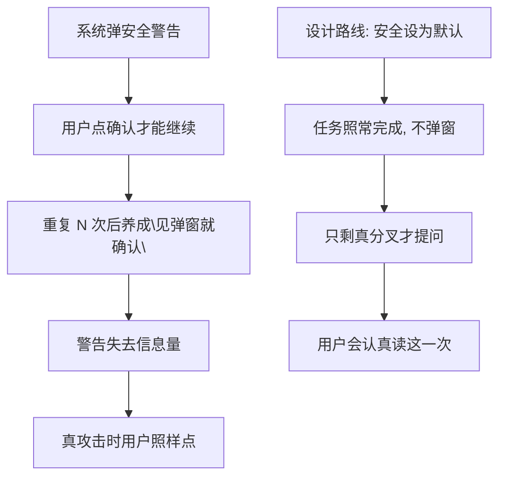

# 可用安全

用户会绕过使他们无法完成工作的控制。Whitten 与 Tygar 表明：密码学 UI 失败则密钥管理失败。安全必须是默认且可完成的任务，而不是考试。

<footer>—— Whitten and Tygar, Why Johnny Can't Encrypt, USENIX Security 1999；对照 Anderson 对操作</footer>

上一课[安全经济学](/cs/security-economics)讲组织激励；缺口下沉到**个人操作**：警告疲劳、证书对话框、MFA 摩擦。本课可用安全。

后课默认已经读完本课钉下的合同，只补差，不从该领域第一性原理重开。

## 问题

浏览器把证书错误做成带「继续前往」按钮的对话框，用户就会点它——PKI 链验证的全部机制在一声「继续」里作废。缺口是三件设计：默认路径必须安全（安全选项是零努力选项）、失败要用人话讲清（谁、对什么、有何后果）、警告总量要砍——每条新警告都在稀释其余警告的分量。

### 钓鱼

可用不等于无钓鱼：把界面做好并不能替用户识别伪造站点。WebAuthn 把凭据绑在 origin 上——假站拿不到真站的签名，这是用设计封死攻击面，不是再教育用户盯着 URL。

Johnny 1999。风险量化下一课试图给决策数字。

## 方法

方法从警告疲劳入手：用户对安全弹窗形成「全点确认」的习惯后，警告退化成仪式。设计原则相反——安全做成默认（自动更新、默认加密），把「问用户」压到最少，且只在真正分叉处问，每个问题都要给用户用得上的判断依据。下一课风险量化。

```mermaid
flowchart TD
  TASK["用户要完成的工作"] --> CTRL["控制"]
  CTRL --> BYPASS["过难则绕过"]
  DEF["安全默认"] --> DONE["仍能完成任务"]
```

## 机制

警告疲劳是一个系统自己训练出来的循环；对照的是把分叉提前吃掉的设计路线：

```mermaid
flowchart TD
  WARN["系统弹安全警告"] --> CLICK["用户点确认才能继续"]
  CLICK --> HABIT["重复 N 次后养成\"见弹窗就确认\""]
  HABIT --> DULL["警告失去信息量"]
  DULL --> ATTACK["真攻击时用户照样点"]
  DEF["设计路线: 安全设为默认"] --> NOASK["任务照常完成, 不弹窗"]
  NOASK --> RARE["只剩真分叉才提问"]
  RARE --> READ["用户会认真读这一次"]
```

机制上人是系统的一部分：MFA 摩擦太大，用户把一次性码转发进聊天群「保存」，控制自己制造了新漏洞；Whitten–Tygar 的实验里多数受试者用 PGP 类工具发不出加密邮件——密钥管理的 UI 失败即密钥管理失败。可用性不是体验附属，是控制生效的条件。量化下一课给管理层优先级，仍要可用。

直觉类比：走廊里的火警铃常年误报，半年后没人再抬头——不是因为员工懒，而是铃声本身已经不再携带信息。每一条 unnecessary 的安全弹窗都在给其它弹窗「扣分」：警告的预算是注意力，不是对话框数量。

WebAuthn 的 origin 绑定可以翻译成「凭据上刻了门牌号」：注册时凭据只认 `bank.example` 这一个域名，钓鱼站的域名不同，签名请求根本发不出去。这是用协议封死路径，而不是再指望用户盯着地址栏比对手高明。

常见误区：把失败归给「用户素质低、多培训就好」。Whitten–Tygar 1999 年的实验里，受训过的受试者多数仍用 PGP 类工具发不出加密邮件——培训的边际收益远低于把安全改成默认选项。设计错了，人就会错；先改设计，再谈教育。

## 边界

不嘲笑用户：失败的是设计不是人——警告疲劳正是系统自己训练出来的行为。风险量化下一课。

## 小结

- 激励之后，个人会绕过难用的控制。
- Johnny：加密 UI 失败即密钥失败。
- 安全默认优于更多对话框。
- 下一课风险量化。
- 出处：Whitten and Tygar, 1999；Anderson。
