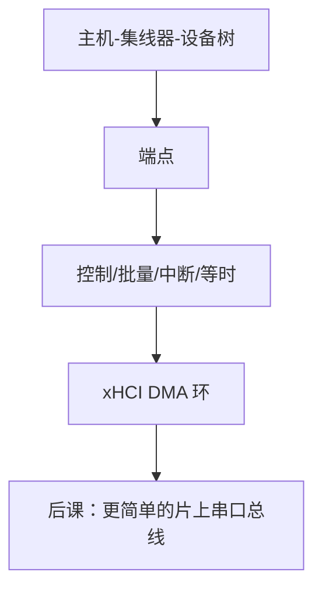

# USB 协议分层

  
USB 把设备、配置、接口、端点叠成树，传输分控制/批量/中断/等时；主机控制器用描述符 DMA 调度微帧，而不是 CPU 比特翻转 D+/D−。

  <footer>—— 据 USB Implementers Forum, USB Specification；Patterson and Hennessy, Computer Organization and Design 整理</footer>

[上一课](/cs/dma-scatter-gather)给出通用 DMA。[PCIe](/cs/pcie-lanes) 上的 xHCI 是主机控制器端点。缺口是 **USB 分层**：与 PCIe TLP 不同的包与端点模型，让键盘、盘、网共用一条树形总线。

## 问题

USB：主机为根的树，集线器分层。设备描述符→配置→接口→端点。传输类型：控制（枚举）、批量（盘）、中断（HID 轮询间隔）、等时（音频，允许丢）。缺口不是再讲 SG 表，而是 xHCI Transfer Ring 上的 TRB 如何对应这些传输。物理层随代变（LS/FS/HS/SS），本课不画眼图。

枚举：复位、取描述符、设地址、配配置——固件/OS 早期就会做，与后课 BIOS 枚举 PCI 并列。

### USB 不是「小版 PCIe」

USB 是主机轮询/调度的共享树（尽管 SS 有更多点对点味道），设备不主动发任意 Memory TLP 到全系统（USB4/雷电另议）。把优盘当 PCIe NVMe 端点，BAR 模型会套错。对主机而言优盘是 SCSI/UAS 命令再进批量端点。

USB 规范是分层权威。Patterson/Hennessy 把 USB 当 I/O 例子。xHCI 规范描述环与 DMA。本课钉层次与传输类，不背描述符每个字段。

## 方法

软件：URB/请求块 → 主机控制器驱动填 TRB → DMA → 端口收发包。盘：Bulk + BOT 或 UAS。HID：中断入端点。与 [MSI](/cs/msi-msix)：xHCI 用 MSI-X 通知环事件。电源：挂起与远程唤醒点名。

对比 I²C/SPI：那些是片内短线，无 USB 描述符树。

## 机制

下一课片上低速总线给传感器与闪存颗粒旁路。显示链路（eDP）不是 USB，帧缓冲课再接。本课把「外设树」从 PCIe 交换机树区分开：PCIe 枚举配置空间；USB 枚举描述符。

## 边界

本课不写 USB4 隧道 PCIe 的全部，不把 Type-C PD 电源合同当主体。不讨论驱动签名。不进入音频等时抖动的信号处理。

后课默认：USB 是主机调度的端点传输；xHCI 用 DMA 环；与 PCIe 端点模型不同。

## 小结

- 设备树 + 四类传输；控制通路做枚举。
- xHCI 把传输变成 DMA 描述符。
- 不是 PCIe Memory TLP 的缩微。
- 出处：USB Specification；xHCI；Patterson and Hennessy, COD。
