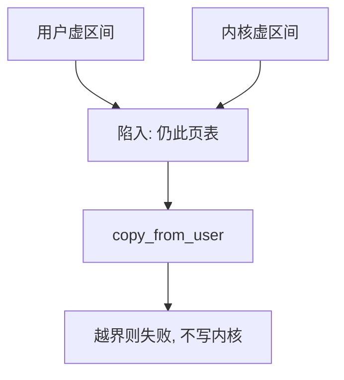

# 用户/内核分裂

每个进程的虚空间常被切成用户一半与内核一半；系统调用不必换页表根，只需切特权。

<footer>—— 据 Tanenbaum and Bos, Modern Operating Systems；Bovet and Cesati, Understanding the Linux Kernel 整理</footer>

[上一课](/cs/addrspace-layout)已画出文本、数据、堆、栈，并点到「内核常在高半」。[内核与用户态](/cs/kernel-user)讲的是特权门，不是这张图怎么切。[分页](/cs/paging-vm)已能把任意虚页标成用户不可访问。缺口是**分裂本身**：为何内核映射进每个进程，用户指针与内核指针如何共存。

## 问题

系统调用要读用户缓冲、要写页表，若内核活在另一套地址空间，每次陷入都换页表根，[TLB](/cs/tlb-translate) 全作废。经典 Unix/Linux 选择：同一套页表里，高地址是内核，页表项清掉用户可访问位；低地址是该进程用户空间。缺口不是再导页表格式，而是约定这道分界，以及内核如何安全地解引用用户指针。

本课不把每种架构的分界数字当考纲。

32 位曾用 3G/1G；64 位用 canonical 空洞把用户与内核远远分开。对象仍是：内核代码在每个进程里都有翻译，用户走不到那些页。

## 方法

硬件用页表项的用户位执行分裂：用户态访问内核虚地址立即故障。[系统调用路径](/cs/syscall-path)上，内核带着自己的指针跑，同时用 `copy_from_user` / `copy_to_user` 触及用户缓冲——那些函数先检查指针落在用户区间，再在故障时把缺页或坏地址变成错误码，而不是内核 oops。

## 机制

分裂让内核成为「始终可见的那一半」：中断、系统调用、缺页入口都能用同一套内核符号。用户隔离仍靠[分页](/cs/paging-vm)的用户位与各进程不同的低半页表，不靠再发明一套环。与特权课的分工：环决定「能不能执行 `csrrw satp`」；分裂决定「用户 load 能不能碰到内核数据」。

后课的 `brk` 只移动用户堆的上限，碰不到内核分界。

## 边界

本课不引入 KPTI 的侧信道对策全文，只承认：把内核从用户页表里拿掉会多一次页表切换，换 TLB 隔离。也不把模块加载的内核虚地址分配写完。用户/内核指针在类型上应分开；教学上记住「用户指针必须经拷贝路径」。

后课默认：合法用户虚区间在分界以下（或 canonical 用户半）。堆如何向高处申请，下一课 `brk` 与堆。

## 小结

- 内核映射进每个进程的高半，陷入少换页表根。
- 用户位执行分裂；用户缓冲经拷贝路径进入内核。
- 堆上限如何移动是 `brk` 的缺口。
- 出处：Tanenbaum *MOS*；Bovet and Cesati, *ULK*；Love, *Linux Kernel Development*。
