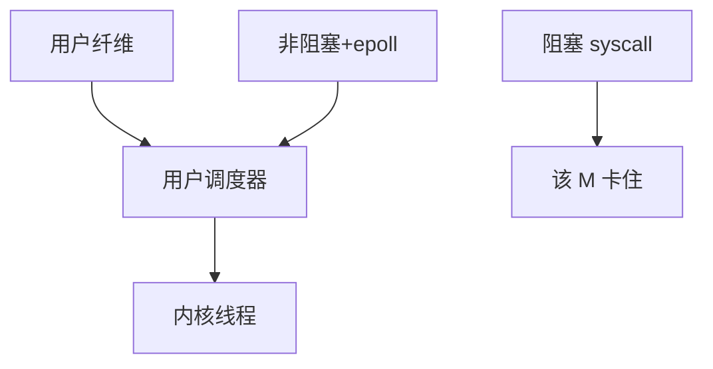

# 用户态调度与 M:N

M:N 把许多用户纤维映射到较少内核线程：切换可在用户完成，但阻塞系统调用会卡住整根内核线程，除非另做包装。

<footer>—— 据 Anderson et al. 对调度器激活的论述；Go/Erlang 运行时实践；[线程](/cs/thread-shared-addr) 为先修</footer>

[sched_ext](/cs/sched-ext) 仍决定内核任务。[ULT/KLT](/cs/ult-klt) 主干有分类。缺口是 **用户态 M:N 的 OS 接头**：阻塞、信号、与 1:1 的取舍。

## 问题

1:1：每个 goroutine 若都是内核线程，创建贵。M:N：用户调度器把可运行纤维放到 M 个 pthread 上。缺口：`read` 阻塞会占死一个 M；需要 netpoller 把 fd 变非阻塞 + 用户等待队列；与 [NAPI](/cs/napi) 无关直接，但 eventfd/epoll 是接头。本课不把 Go GMP 细节背完。

scheduler activations 试图让内核通知用户「这根线程阻塞了」。Linux 上实践多是运行时自己包装 syscall。

## 方法

运行时：工作窃取队列，fiber 切换改上下文（不进核）。I/O：epoll + 非阻塞。对照 [POSIX AIO](/cs/posix-aio)：一个内核完成，一个用户把阻塞变事件。对照 [uffd](/cs/userfaultfd)：缺页仍进核。对照 EEVDF：内核只看见 N 个线程的 util。

## 机制

M:N 用用户切换换百万级并发，把 OS 调度粒度变粗。正确性取决于运行时包装了所有阻塞点。不要写成语言课的 async 语法。与 [cgroup](/cs/cgroup-cpu-sched)：限额作用在 M 上，纤维数看不见。

信号与 TLS：要按纤维还是按 M 投递，是实现地狱，课序只要求意识到裂缝。

实现上：运行时必须包装所有可能阻塞的 libc，包括 getaddrinfo 和锁。信号投到 M 上，要转给当前纤维。cgroup 限额看见的是 M 的 CPU，不是纤维数。 读法上只引用[上一课](/cs/sched-ext)的结论，不把对象换成训练推理或限价簿。

本课在操作系统进阶的「调度进阶 / 公平、实时与能耗」课序里，对象是 **用户态调度与 M:N**。

- 先修只引用，不重导：上一课的结论当公理，本课只补差。
- 五栏不吞并：不把本课写成大模型训练/推理，也不写成限价簿或权重量化。
- 文献用 OSTEP、McKusick、内核文档与具名会议论文；不发明 arXiv 编号。

## 边界

本课不引入 stackful vs stackless 的全部。不保证与 C 库的取消点。下一课更简单的一端：协作调度。

版本字段会变，课序钉的是机制对象「用户态调度与 M:N」，不是某一主线内核的结构体名。
后课默认：M:N 依赖非阻塞包装。自愿让出的协作式调度，下一课。

## 小结

- M:N：用户调度纤维，内核只见少量线程。
- 阻塞 syscall 是主要裂缝。
- 协作调度是下一课。
- 出处：Anderson 调度器激活；Go 运行时；*OSTEP* 线程。
