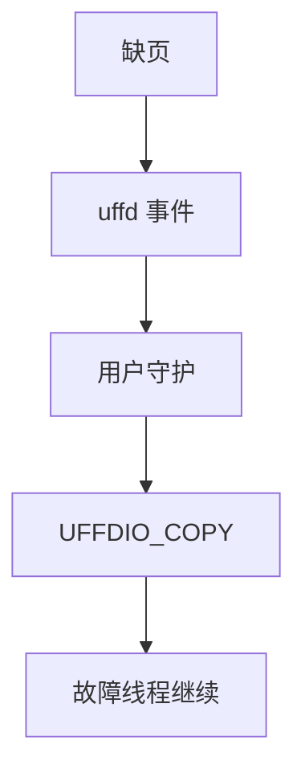

# userfaultfd

userfaultfd 把缺页从内核填页路径转到用户守护进程：进程 sleep 在 fault 上，由另一线程 ioctl 拷入内容。

<footer>—— 据 Linux userfaultfd(2)；Criu 与 QEMU postcopy 对 uffd 的用法</footer>

[memcg](/cs/memcg) 仍由内核选页。[FUSE](/cs/fuse) 把文件操作出核。缺口是 **虚存 fault 出核**：热迁移后拷、懒填充、快照恢复。不是 inotify。

## 问题

`UFFDIO_REGISTER` 把 vma 标成用户填。缺页：内核排队事件，阻塞故障线程。管理线程 `UFFDIO_COPY`/`ZEROPAGE`/`CONTINUE`。缺口：WP 模式（写保护事件）服务检查点；与 [KSM](/cs/ksm)/THP 的组合限制；不能无限阻塞持锁路径。本课不把 CRIU 算法写完。

与 SIGSEGV 用户处理者不同：uffd 可在不改应用二进制的情况下由外部填。fork 与事件传递有规则。

## 方法

QEMU postcopy：客户机缺页 → 源机拉页 → uffd copy 进目标。对照 FUSE：一个填文件页，一个填匿名/已注册区。对照 [NFS](/cs/nfs-semantics)：远程填的是文件协议；uffd 是本地虚存协议。

## 机制

uffd 把「页内容从哪来」做成可插策略，活迁移与惰性恢复依赖它。内核仍管页表与 rmap，用户只提供字节。不要写成数据库外部页表。安全：能操作 uffd 的进程等于能改目标地址空间。

性能：每缺页往返，适合冷页，不适合热路径。

实现上：WP 模式把写保护事件交给用户，可做检查点。COPY 必须填满故障范围，否则线程继续会再 fault。fork 后 uffd 不自动监视子进程。 读法上只引用[上一课](/cs/memcg)的结论，不把对象换成训练推理或限价簿。

本课在操作系统进阶的「内存进阶 / 回收、迁移与加固」课序里，对象是 **userfaultfd**。

- 先修只引用，不重导：上一课的结论当公理，本课只补差。
- 五栏不吞并：不把本课写成大模型训练/推理，也不写成限价簿或权重量化。
- 文献用 OSTEP、McKusick、内核文档与具名会议论文；不发明 arXiv 编号。

## 边界

本课不引入 minor fault continue 的全部文件映射细节。不保证与 hugetlbfs 的每组合。下一课物理内存本身可插拔：热插拔。

版本字段会变，课序钉的是机制对象「userfaultfd」，不是某一主线内核的结构体名。
后课默认：缺页可由用户态填。内存条上线/下线，下一课热插拔。

## 小结

- userfaultfd 把 fault 交给用户 ioctl 填页。
- 用于 postcopy 迁移与惰性填充。
- 内存热插拔是下一课。
- 出处：Linux `userfaultfd(2)`；CRIU；QEMU postcopy。
