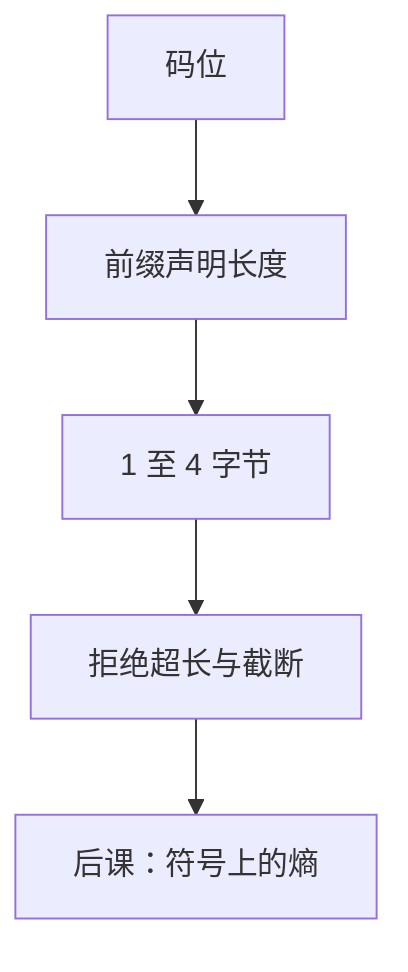
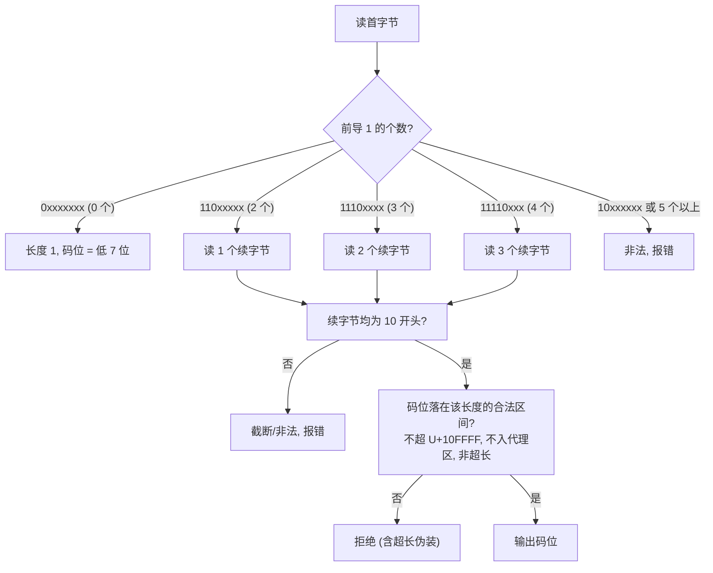

# UTF-8 变长

ASCII 必须仍是单字节，其余码位用前缀声明长度；续字节以 $10$ 开头，既可自同步，又让非法序列无处躲。

<footer>—— 据 RFC 3629；The Unicode Standard 整理</footer>

上一课[字符与 Unicode](/cs/char-unicode)钉死了：抽象字符先有码位，再选字节方案；并已点名 UTF-8 把 ASCII 嵌成子集。本课不重划 `U+10FFFF`，也不从「各国代码页史」另起。缺口是：变长的**比特前缀**还没有写成表。没有这张表，缓冲按字节切会切断序列，超长编码会把 `U+0000` 伪装成多字节。

## 问题

码位是整数；文件与套接字只看见字节。固定 32 位会把 ASCII 撑成四倍，且与 Unix 字节流习惯冲突。缺口因此不是再编号一次，而是一套前缀：首字节的前导 $1$ 的个数声明总长，续字节一律 `10xxxxxx`，合法码位不得用过长形式写出。

本课只钉 UTF-8。UTF-16 代理对上一课已警告宽度不是「一个字符」；本课不把它当默认交换格式。熵与分布还没有：变长省的是常见码位的**字节数**，不是 Shannon 信息量。

### 自同步不是纠错

从任意字节向后扫描，遇到非 `10` 开头的即可当作候选首字节。这能发现某些截断，不能纠正翻转——那是[纠错码](/cs/error-correcting-intuition)的几何。把 UTF-8 前缀当成汉明码，后课 CRC 会没有位置。

RFC 3629 禁止超长编码，并把合法范围限制在 Unicode 码位。Pike 与 Thompson 的原始 UTF-8 设计目标之一就是：ASCII 字节在多字节流里仍只表示 ASCII。

## 方法

码位 $0$–$7\mathrm{F}$：一字节 `0xxxxxxx`。$80$–$7\mathrm{FF}$：`110xxxxx 10xxxxxx`。再往上三字节、四字节，首字节分别为 `1110xxxx`、`11110xxx`。译码时必须检查：续字节形态、码位落在对应范围、不落在代理区、不超过 `10FFFF`。失败则替换或报错，不得当 Latin-1 继续吃。

```mermaid
flowchart TD
  CP["码位"] --> PRE["前缀声明长度"]
  PRE --> BYTES["1 至 4 字节"]
  BYTES --> REJ["拒绝超长与截断"]
  REJ --> LATER["后课：符号上的熵"]
```

相等：规范化后再比码位序列。按原始字节比，同一字符的非法超长与合法短形式会变成两个串——所以必须先拒绝超长。

## 机制

有了前缀，词法扫描可以按字节走并在字符边界停下。操作系统路径仍是字节；解释成字符时声明 UTF-8，则非法序列是数据错误，不是「少见汉字」。C 的 `char` 是字节，不是码位；宽字符类型若按码位索引，与 UTF-8 存储不是同一把尺子。后课信息量把字母表当随机变量的取值，默认这张表已经能写成字节。

一个 UTF-8 译码器逐字节校验的完整判定路径：

```mermaid
flowchart TD
  B0["读首字节"] --> N{"前导 1 的个数?"}
  N -->|"0xxxxxxx (0 个)"| A1["长度 1, 码位 = 低 7 位"]
  N -->|"110xxxxx (2 个)"| R2["读 1 个续字节"]
  N -->|"1110xxxx (3 个)"| R3["读 2 个续字节"]
  N -->|"11110xxx (4 个)"| R4["读 3 个续字节"]
  N -->|"10xxxxxx 或 5 个以上"| BAD0["非法, 报错"]
  R2 --> CHK["续字节均为 10 开头?"]
  R3 --> CHK
  R4 --> CHK
  CHK -->|否| BAD1["截断/非法, 报错"]
  CHK -->|是| RNG["码位落在该长度的合法区间?<br/>不超 U+10FFFF, 不入代理区, 非超长"]
  RNG -->|否| BAD2["拒绝 (含超长伪装)"]
  RNG -->|是| OUT["输出码位"]
```

数字实例：汉字「中」的码位是 U+4E2D（十六进制 `0100 1110 0010 1101`），落在三字节区间，装进 `1110xxxx 10xxxxxx 10xxxxxx` 得到 `E4 B8 AD`。一个纯 ASCII 文件在 UTF-8 下体积不变；若换成固定 4 字节的 UTF-32，同样内容直接膨胀到 4 倍。

常见误区：把「字节长度」当「字符个数」。`len()` 在 C 与多数系统调用里数的是字节，「中国」是 6 字节 2 码位；截断到 5 字节会把第二个字切成残缺序列。凡是涉及切片、求长度、按位置替换，先问清楚尺子是字节还是码位。

直觉类比：首字节的前导 1 像「车头报车厢数」——`110` 喊「带 1 节」，`11110` 喊「带 3 节」，续字节 `10` 开头则是每节车厢的门牌格式。在字节流任何位置掉进来，看见 `10` 开头就知道自己是车厢不是车头，向后找车头即可重新对齐——这就是「自同步」，但它只能发现损坏，修不回原文。

## 边界

本课不讲 NFC/NFD、字素簇、emoji 序列。也不把压缩（Huffman）提前：变长是码位到字节的语法，不是按频率编的最优码。

后课默认：文本交换用 UTF-8；长度要声明是字节还是码位；非法与超长序列不是合法数据。

## 小结

- UTF-8 用前缀变长，ASCII 单字节嵌入。
- 续字节 `10` 开头，可自同步；超长必须拒绝。
- 前缀能发现部分非法，不是纠错码。
- 出处：RFC 3629；The Unicode Standard。
