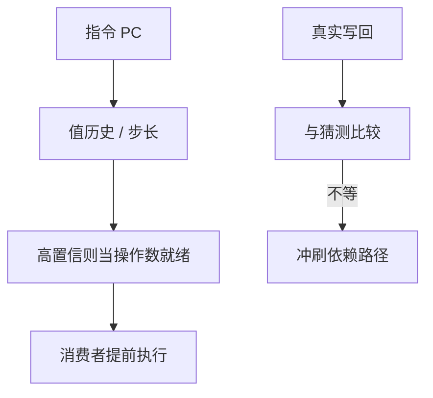

# 值预测直觉

数据流极限说：没有操作数就不能算。若操作数常常等于上次或等于一个可预测常数，可以先用猜测值算，核对失败再像误预测一样冲刷。

<footer>—— 据 Lipasti and Shen, Exceeding the Dataflow Limit via Value Prediction, MICRO 1996 整理</footer>

[上一课](/cs/store-set-predict)预测的是「要不要等」，不是「值是多少」。寄存器 RAW 在[重命名](/cs/register-renaming)之后仍是硬边：源物理寄存器未写回则不能选发。本课不重训 SSID。缺口是**值预测**：猜源操作数或 load 返回值，把数据流边变成可撤销的推测边。

## 问题

许多指令的结果是上次同一 PC 的结果（可步长、可不变）：循环感应变量、函数返回的错误码、反复读同一内存。若等真值，窗口在长延迟 load 上枯竭。[MLP](/cs/mshr) 能重叠缺失，但依赖链上的 ALU 仍串着。缺口不是更大的 IQ，而是**把「上次值 / 步长」当成预测操作数，核对写回时比较**。

Lipasti–Shen 指出：正确性仍靠核对；值预测提高的是有效 ILP，失败代价类似分支误预测。后续研究对整数 ALU 收益有限，对长延迟 load 更有吸引力。

## 方法

按指令 PC 建值历史表：上一结果、可选步长、置信度。高置信则把猜测值写入「假就绪」的物理槽或旁路给消费者。真实结果写回时比较：相等则当什么都没发生；不等则冲刷该指令之后的窗口（或精确 replay 依赖链）。

load 值预测可与[存储集](/cs/store-set-predict) 叠：先猜不依赖，再猜数据；任一失败都要恢复。

## 机制

这是[推测恢复](/cs/speculation-recovery) 的第三种触发源：分支错、内存消歧错、值错。检查点必须能区分，否则一次值误预测会把 GHR 也卷回去——实现上值检查点可以更局部。置信度训练与循环器类似：规律才猜，随机数据不要猜。

商业核长期对通用值预测谨慎：核对带宽、错误冲刷、以及与内存模型交互的复杂度，往往吃掉收益。教学上它标明数据流极限不是物理极限。

## 边界

本课不把神经网络值预测、也不把「预言执行」写成产品方案。不要与分支方向预测混淆：方向是控制流，值是数据流。前端取指宽度仍可能在值预测很准时成为瓶颈——那是下一课取指译码带宽。

后课默认：数据流边原则上可被值猜测暂时切断，但正确性永远在核对。窗口填满之后，首先卡住的常常是 IF/ID，不是 ALU。

## 小结

- 值预测用历史猜测操作数，核对失败则冲刷。
- 它超过经典数据流极限，但误预测很贵，实践中多限于特殊情况。
- 前端每拍能送进多少条，是下一课带宽。
- 出处：Lipasti and Shen, *MICRO*, 1996。
