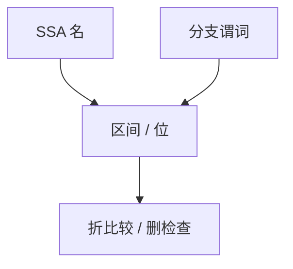

# 值范围分析

在格上跟踪整数可能取值的区间或位掩码：比较可折成常量，无符号越界检查可删，switch 可变紧凑。

<footer>—— 据 Cousot 区间域；Harrison 的范围分析实践；龙书与 LLVM ValueTracking 整理</footer>

上一课[PRE](/cs/partial-redundancy-elim)移动表达式。缺口是**值的约束**：`if (x>=0 && x<n)` 之后 `x` 的范围。值范围分析（VRA）是[抽象解释](/cs/abstract-interpretation)的区间/位域在 SSA 上的应用。本课钉用途，不写完整八边形域。

## 问题

常量传播只认单点。范围：`[0,255]` 使 `x&255` 变恒等，`x<256` 变真。缺口是**分支后的收紧**（与 SCCP 的控制流敏感同类），服务消除检查与选择指令。

位域：已知低位为零则对齐。与[归纳变量](/cs/strength-reduction-iv)：IV 的闭式给出精确范围。

### 范围不是类型

`uint8` 的类型范围是 `[0,255]`；分析可更窄。类型系统的 Option 与范围分析互补：一个是语言，一个是 IR 事实。

Cousot 区间。GCC VRP。LLVM 的 ConstantRange / LazyValueInfo。本课可靠 over-approx：真实值 ⊆ 区间。

## 方法

格：区间，交为收紧，并为合并（φ、未知枝）。加宽防循环升链。分支：真枝交上谓词。

与 UB：有符号溢出若 UB，分析可假设不溢出以收紧——危险与后课 UB 优化同一刀。

## 机制

指针范围（对象内偏移）服务越界消除，须 provenance。不要把分析当沙箱。浮点范围更少用，NaN 破坏全序。

PGO 可提供热范围，但是动态的，须与静态可靠分开。

## 边界

本课不写关系域（`x<y`）全文。后课默认：整数范围可消比较。下一课 SSA 构造：许多分析假设 SSA，该把 φ 插对。

也不把范围当依赖类型 `Fin n` 的替代。

## 小结

- 值范围：区间/位格，分支收紧。
- 用于折比较、删冗余检查、助向量化。
- 可靠近似；循环要加宽。
- 出处：Cousot；GCC VRP / LLVM ConstantRange；对照 Wegman SCCP。
