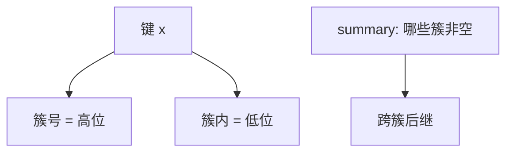

# van Emde Boas

把 $[0,U)$ 对半切成 $\sqrt{U}$ 个簇，再递归；前驱后继跟着高位走簇、低位走内部，时间 $O(\log\log U)$。

<footer>—— 据 van Emde Boas, Preserving Order in a Forest, FOCS 1975 / Math. Systems Theory 1977；Cormen, Leiserson, Rivest and Stein 第 20 章整理</footer>

[上一课](/cs/double-ended-pq) 与比较堆在任意有序域上是 $\Theta(\log n)$。键若是机器字宇宙 $[0,U)$，$n$ 可以远小于 $U$，比较模型不是唯一选择。[Trie](/cs/trie) 按比特下降是 $O(w)$。本课不维护堆序。缺口是 van Emde Boas 树：递归平方根切分，`insert`/`delete`/`successor` $O(\log\log U)$。

## 问题

需要有序整数集：成员、前驱、后继。平衡 BST 不知 $U$。vEB：结构含 `min`、`max`、一个 `summary` vEB（哪些簇非空）、以及 $\sqrt{U}$ 个簇各一棵子 vEB。高位 $\lfloor x/\sqrt{U}\rfloor$ 选簇，低位 $x\bmod\sqrt{U}$ 在簇内。后继：簇内有则递归；否则 summary 上找下一个非空簇再取其 min。缺口是**宇宙大小进递归深度** $\log\log U$，不是 $n$。

空结构只存 min/max 的原型可降空间。完整数组簇是 $\Theta(U)$ 空间，须用哈希簇才接近 $O(n)$，那是 y-fast 的动机之一。

## 方法

插入：空则只写 min；否则维护 min 不变式（更小的键顶替 min，旧 min 插进簇），再更新 summary。删除对称，注意 min 无簇副本的设计变体。递归底：$U=2$ 存两比特。

与位图：位图后继是扫字，$\Theta(U/w)$ 最坏一段；vEB 保证 $\log\log U$。$U=2^{32}$ 时 $\log\log U=5$，常数与实现相关。

## 机制

时间递推 $T(U)=T(\sqrt{U})+O(1)$ 得 $O(\log\log U)$。空间朴素 $\Theta(U)$。不要在 $U$ 超大时无哈希地分配簇数组。比较模型下信息下界仍 $\log n$；vEB 用了键是整数这一限制。

## 边界

本课不把 x-fast trie 的全部分层位图写完——下一课 y-fast 用 x-fast 加平衡树块把空间收到 $O(n)$。也不把融合树的 $O(\log n/\log\log n)$ 写进来。

后课默认：宇宙 $U$ 已知时后继可以 $\log\log U$。线性空间用 y-fast trie。

## 小结

- vEB：平方根分簇，前驱后继 $O(\log\log U)$。
- 朴素空间 $\Theta(U)$；要 $O(n)$ 空间看 y-fast。
- 出处：van Emde Boas, 1975/1977；Cormen et al. 第 20 章。
