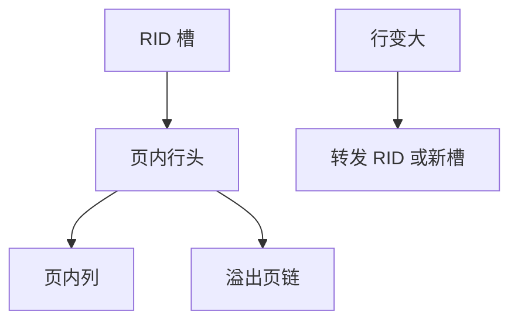
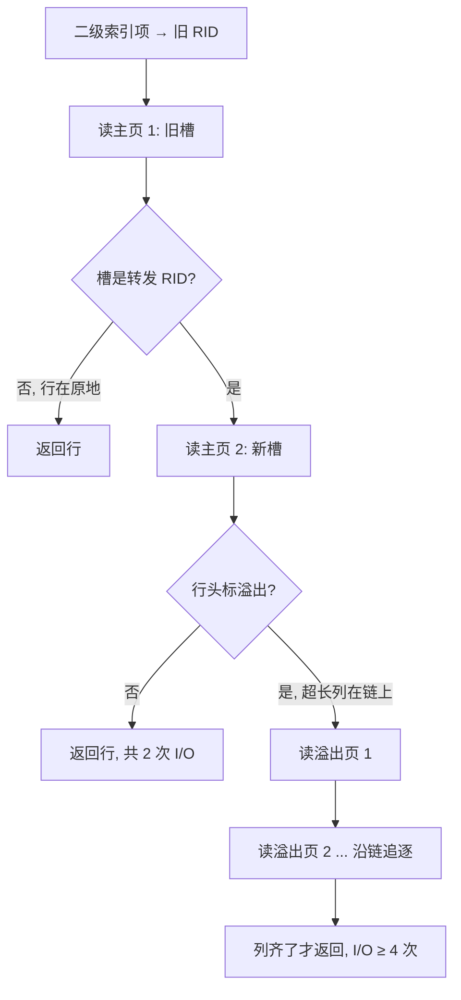

# 变长记录与溢出页

槽化页假定记录进一页；变长列一涨，行要拆成页内头与溢出页链，RID 仍指头，扫描变成追逐。

<footer>—— 据 Ramakrishnan and Gehrke 页与槽；Gray and Reuter；主干 page-slot 的溢出补全</footer>

[上一课](/cs/learned-index)在有序键上赌模型。本课不拟合 CDF。缺口是行存物理：主干 [页与槽](/cs/page-slot) 给定长直觉；真实 `VARCHAR`/`JSONB` 变长，更新变长导致页满、行迁移、溢出页（overflow / TOAST 一类）。延迟物化与覆盖索引都假设 RID 仍能找到载荷。

## 问题

插入变长行：页空闲不够则新页或压缩空洞。更新变长：行变大可能迁到另一页，旧槽留转发地址（forwarding RID），索引可仍指旧 RID，避免全改二级索引。极大字段：页内只留指针，数据在溢出页或侧表。缺口是**访问路径变间接**，I/O 从一次变多次，代价模型要计。

碎片：频繁变长更新留下不可用小洞，需要页内整理或 vacuum。与 pin-latch：迁移时持写闩，读者要跟转发。

PostgreSQL TOAST、InnoDB 溢出页是产品名。本课机制：行头+溢出链。本课不把大对象 API 写完——下一课 BLOB。

## 方法

页格式：槽指向行头；行头含标志「有溢出」。扫描：跟指针读列。压缩行（前缀压缩）是另一减少溢出的手段。最大行限制：超过则强制溢出或拒绝。

索引：键通常截断或哈希前缀，完整键在堆行。比较长键可能要取溢出——执行器注意。

```mermaid
flowchart TD
  RID["RID 槽"] --> HEAD["页内行头"]
  HEAD --> IN["页内列"]
  HEAD --> OV["溢出页链"]
  UPD["行变大"] --> FWD["转发 RID 或新槽"]
```

## 机制

WAL：溢出页与主页都要记生理日志，恢复顺序按 LSN。延迟物化：先读行头谓词列，谓词列若在溢出则迟物化失败变早读。列存较少「一行跨页」，但超长字符串仍有字典块。

缓冲：溢出页易成一次性，2Q 应快速逐出，避免污染。

一次二级索引点查在「转发 + 溢出」叠加时的真实 I/O 路径——间接跳如何层层加码：

```mermaid
flowchart TD
  IDX["二级索引项 → 旧 RID"] --> P1["读主页 1: 旧槽"]
  P1 --> Q{"槽是转发 RID?"}
  Q -->|否, 行在原地| V1["返回行"]
  Q -->|是| P2["读主页 2: 新槽"]
  P2 --> Q2{"行头标溢出?"}
  Q2 -->|否| V2["返回行, 共 2 次 I/O"]
  Q2 -->|是, 超长列在链上| OV1["读溢出页 1"]
  OV1 --> OV2["读溢出页 2 ... 沿链追逐"]
  OV2 --> VF["列齐了才返回, I/O ≥ 4 次"]
```

数字实例：按 4 KB 页算，一行 `VARCHAR` 从 200 B 更新到 5 KB 时，旧页塞不下——典型实现（如 TOAST 阈值约四分之一页）会把超长列拆出侧表，页内行头只留 18 B 左右的指针。此后每次读该列，I/O 从 1 页变 2 页起，转发再各加一跳。

转发 RID 可以想象成「旧门上贴的搬家便条」：二级索引还写着旧地址，一敲门，便条指去新家。好处是几十个索引一个都不用改；代价是此后每一次点查都多付一跳 I/O，直到 vacuum 或页整理把索引批量改写干净。

常见误区：以为二级索引里存着完整的键值就行、与行在哪无关。长键（比如整段 URL）常被截断或取前缀放进索引项，比较相等够了，取回整行仍要沿 RID 追——若谓词列恰好在溢出链上，「延迟物化」的省 I/O 收益会反转为提前多次读。

## 边界

本课不讲 BLOB 流式 API 与外部文件。也不把宽列单元格当溢出链。表分区是水平切，溢出是垂直拆行。

后课默认：变长更新可能转发与溢出，点查 I/O 不只一页。大对象存储：专门的大值路径，避免普通行槽被单列撑爆。

转发保持二级索引稳定，代价是每次多一次跳。

## 小结

- 变长行用槽+可选溢出链；更新可转发 RID。
- 代价与 WAL 必须看见间接跳。
- 大对象存储下一课：超大值不走普通槽。
- 出处：Ramakrishnan and Gehrke；Gray and Reuter；TOAST/溢出实践。
